# USAC Linux

Esta es una guía paso a paso para compilar e instalar un kernel personalizado USAC Linux. En esta guía, aprenderemos cómo descargar el código fuente del kernel, configurar el kernel, compilarlo, instalarlo, configurar GRUB, y agregar llamadas al sistema personalizadas.

## Instalación de Dependecias

Primero necesitamos instalar algunos paquetes necesarios para la compilación:

```bash
sudo apt install build-essential libncurses-dev bison flex libssl-dev libelf-dev fakeroot dwarves
```

## Descargar el código fuente del kernel

Para descargar el código fuente del kernel, podemos hacerlo desde el sitio oficial de [kernel.org](https://www.kernel.org/).

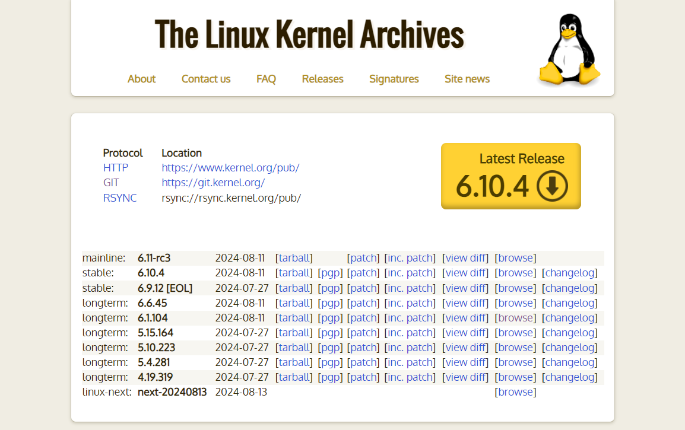

Usaremos la version **longterm** del kernel (6.6.45 hasta este momento). Para esto se deberá copiar el enlace de la opción **tarball** y ejecutar el siguiente comando:

```bash
wget https://cdn.kernel.org/pub/linux/kernel/v6.x/linux-6.6.45.tar.xz
```

Y luego para descomprimir el archivo:

```bash
tar -xf linux-6.6.45.tar.xz
```

## Configuración del Kernel

Una vez descargado el código fuente, debemos configurar el kernel. Para esto, podemos copiar la configuración actual del kernel que estamos utilizando. Para esto, ejecutamos el siguiente comando:

```bash
cd linux-6.6.45
```

La configuración del kernel se debe especificar en un archivo .config. Para no escribir este desde cero vamos a copiar el archivo de configuración de su Linux actualmente instalado:

```bash
cp -v /boot/config-$(uname -r) .config
```

Sin embargo, este esta lleno de modulos y drivers que no necesitamos que pueden aumentar el tiempo de compilación. Por lo que utilizamos el comando **localmodconfig** que analiza los módulos del kernel cargados de su sistema y modifica el archivo .config de modo que solo estos módulos se incluyan en la compilación. Tomar en cuenta que esto causará que nuestro kernel compilado solo funcione en nuestra máquina.

```bash
make localmodconfig
```

Luego tenemos que modificar el .config, ya que al copiar nuestro .config se incluyeron nuestras llaves privadas, por lo que tendremos que reliminarlas del .config.

```bash
scripts/config --disable SYSTEM_TRUSTED_KEYS
scripts/config --disable SYSTEM_REVOCATION_KEYS
scripts/config --set-str CONFIG_SYSTEM_TRUSTED_KEYS ""
scripts/config --set-str CONFIG_SYSTEM_REVOCATION_KEYS ""
```

## Compilación del Kernel

Ahora que tenemos la configuración del kernel, podemos proceder a compilarlo. Para esto, ejecutamos el siguiente comando:

```bash
# Usar todos los núcleos disponibles
fakeroot make -j$(nproc)

# Otra opción
fakeroot make -jn
```

FakeRoot es una herramienta que permite ejecutar comandos como root sin tener privilegios de superusuario. Esto es necesario para la compilación del kernel. También se utiliza el comando **-j$(nproc)** para que la compilación se realice en paralelo, utilizando todos los núcleos de nuestro procesador. Otra opción es utilizar **-jn** para especificar el número de núcleos a utilizar.

Aquí podemos ver el uso de CPU y memoria durante la compilación del kernel:

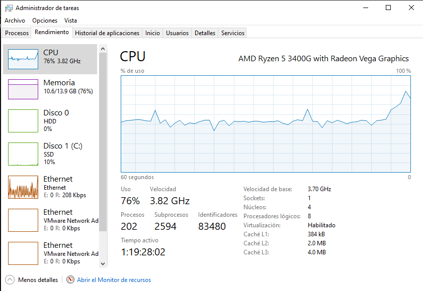

Una vez que la compilación haya finalizado, se verá algo similar a esto:

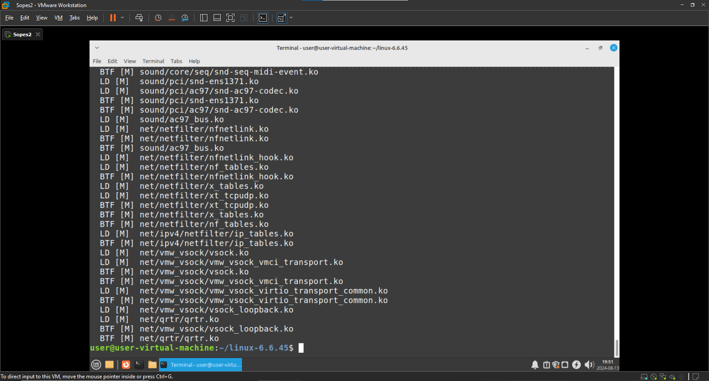

Podemos verificar que la imagen del kernel se haya generado correctamente:

```bash
echo $?
```

Este comando debería devolver 0 si la compilación fue exitosa, de lo contrario regresará el código de error.

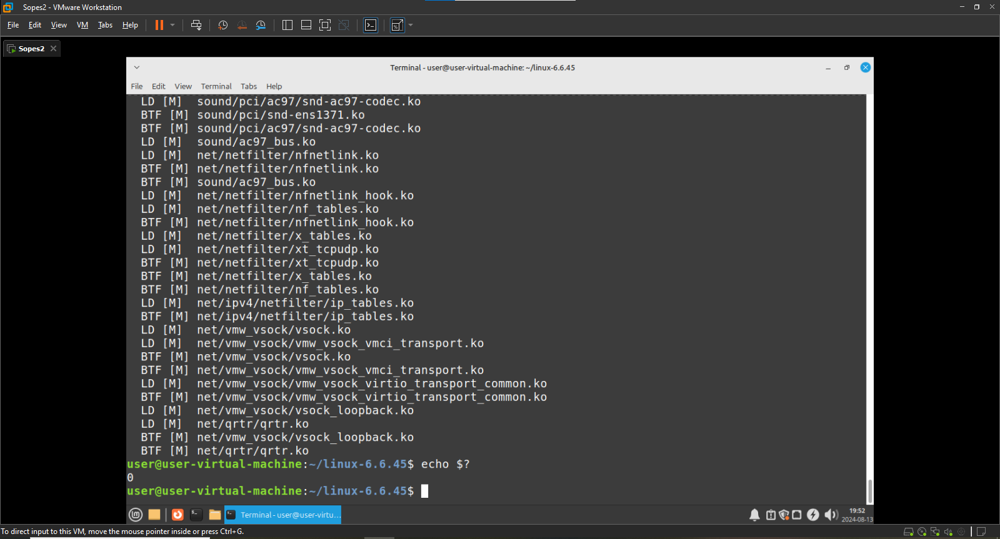

## Instalación del Kernel

Para instalar el kernel, ejecutamos el siguiente comando para instalar los módulos del kernel:

```bash
sudo make modules_install
```

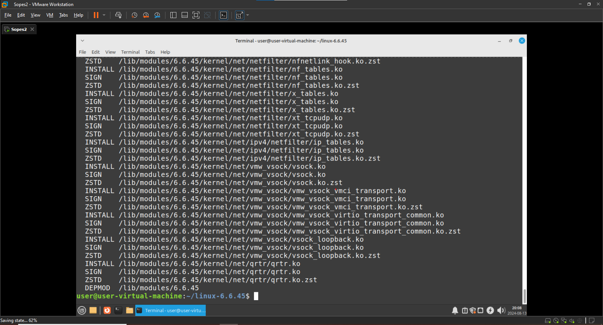

Luego, instalamos el kernel:

```bash
sudo make install
```

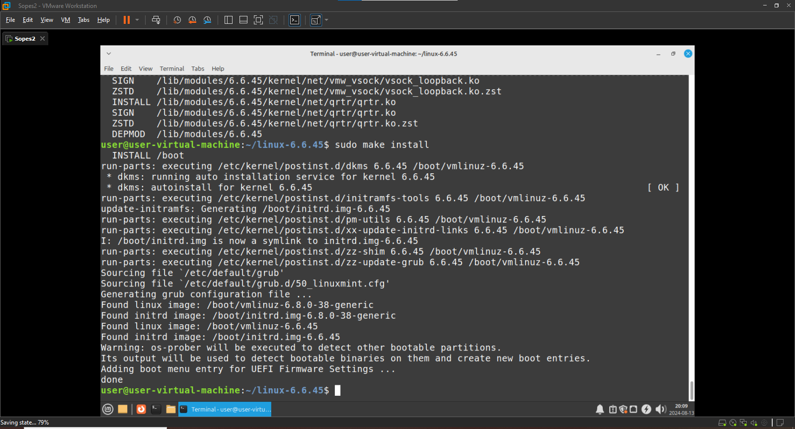

## Configuración del GRUB

Para que el sistema inicie con nuestro nuevo kernel, debemos configurar GRUB. Para esto, ejecutamos el siguiente comando:

```bash
sudo apt update
sudo add-apt-repository ppa:danielrichter2007/grub-customizer
sudo apt install grub-customizer
sudo apt update
```

Este comando instalará GRUB Customizer, una herramienta que nos permite configurar GRUB de forma gráfica. Una vez instalado, ejecutamos el siguiente comando para abrir GRUB Customizer:

```bash
sudo grub-customizer
```

Aquí podemos seleccionar nuestro nuevo kernel como predeterminado y configurar otras opciones de GRUB. Una vez que hayamos terminado, guardamos los cambios y cerramos GRUB Customizer.

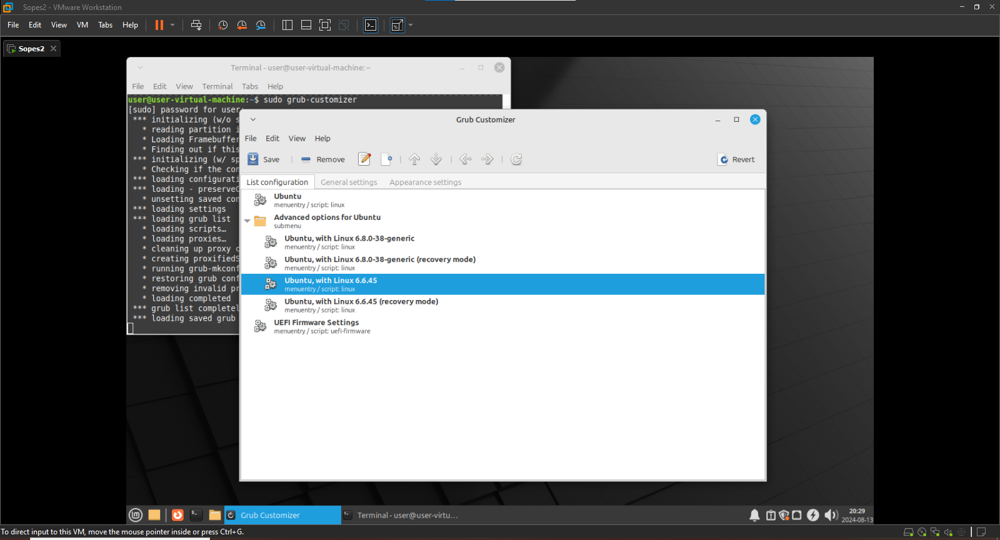
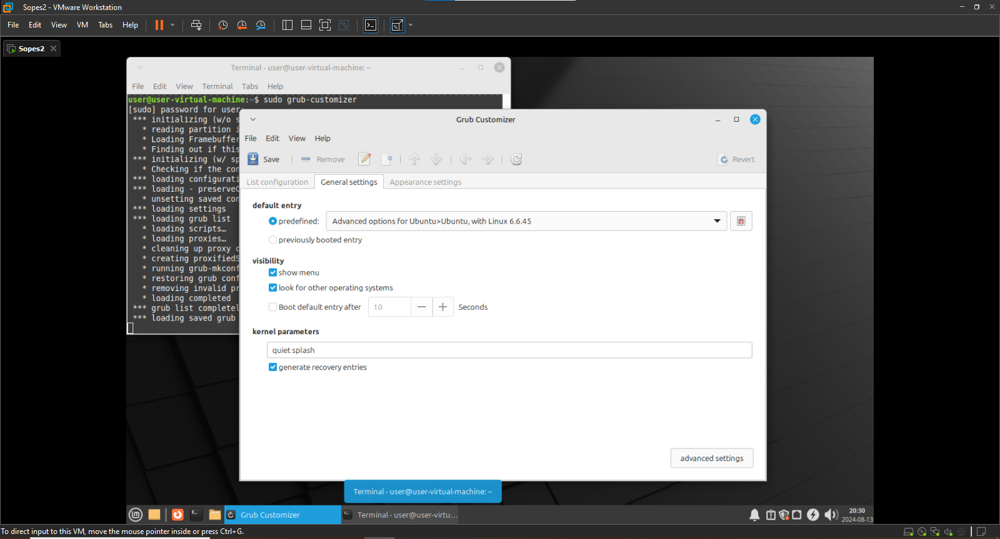

Al fin podemos reiniciar nuestro sistema y verificar que el nuevo kernel se haya instalado correctamente:

```bash
sudo reboot
```

Seleccionames nuestro nuevo kernel en el menú de GRUB y esperamos a que el sistema inicie.

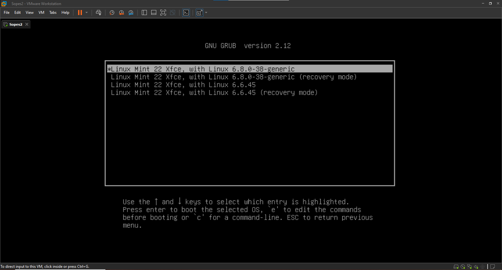

Para verificar que el nuevo kernel se haya instalado correctamente, podemos ejecutar el siguiente comando:

```bash
uname -r
```

Donde **uname -r** nos mostrará la versión del kernel que se está ejecutando actualmente.

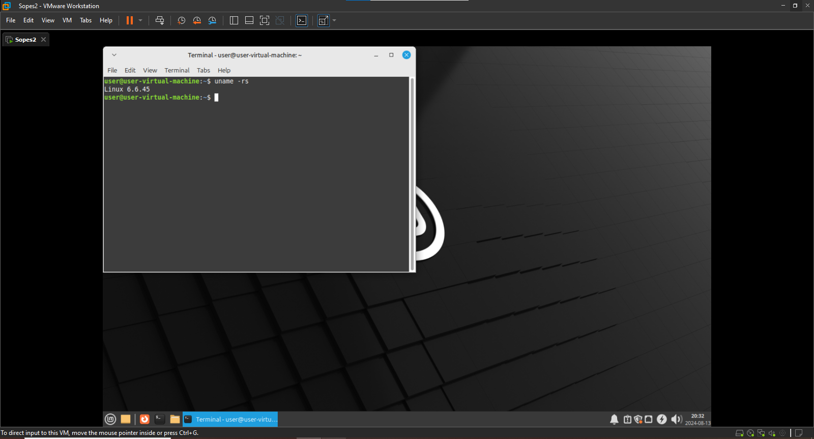

## Configuración Inicial

Para agregar un mensaje de bienvenida al kernel, podemos modificar el archivo **init/main.c**. En este archivo, podemos agregar un mensaje de bienvenida utilizando la función **printk**. Por ejemplo:

```c
void start_kernel(void)
{
    // Código existente...

    // Agrega tu mensaje de bienvenida
    printk("¡Bienvenido a USAC Linux!\n");
    printk("Kevin Ernesto Garcia Hernandez - 202113553\n");

    // Código existente...

}
```

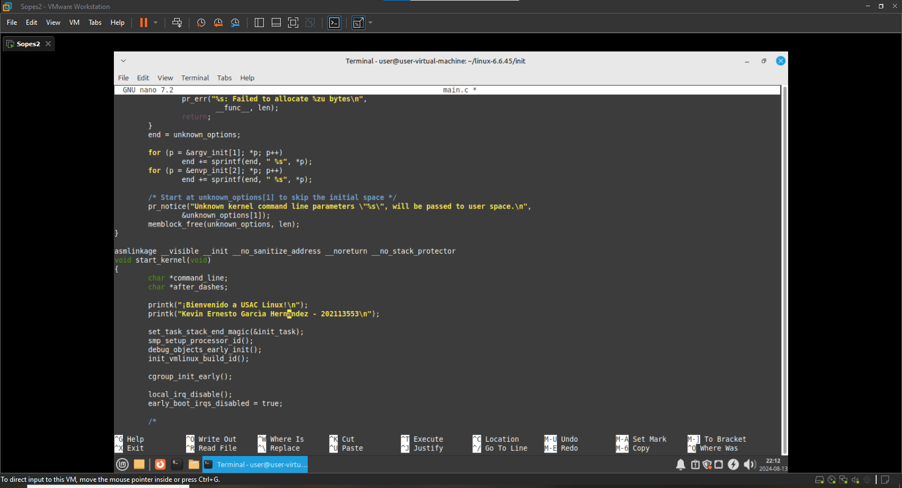

También podemos modificar el nombre del sistema que se muestra al ejecutar el comando **uname**. Para esto, podemos modificar el archivo **include/linux/uts.h**. En este archivo, podemos modificar la definición de **UTS_SYSNAME**. Por ejemplo:

```c
#ifndef UTS_SYSNAME
// Cambiamos el nombre del sistema
#define UTS_SYSNAME "USAC Linux"
#endif
```

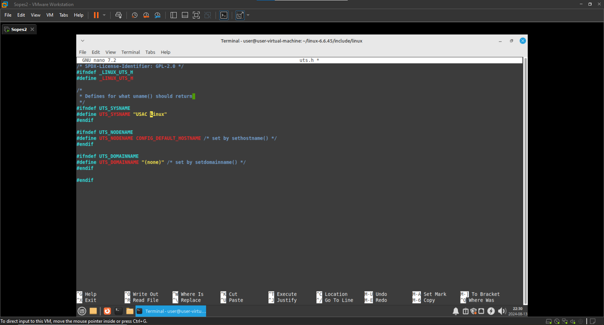

Una vez que hayamos realizado estos cambios, podemos compilar nuevamente el kernel y reiniciar el sistema para ver los cambios reflejados.

```bash
# Compilación del kernel
fakeroot make -j4
# Verificar si la compilación fue exitosa
echo $?

# Instalación del kernel
sudo make modules_install
sudo make install

# Reiniciar el sistema
sudo reboot
```

Para verificar que los cambios se hayan aplicado correctamente, ejecutamos los siguientes comandos:

```bash
# Verificar SYSNAME
uname -rs

# Verificar mensaje de bienvenida
dmesg | grep "USAC Linux"
dmesg | grep "202113553"
```

Nos mostrará el mensaje de bienvenida y el nombre del sistema que hemos configurado.

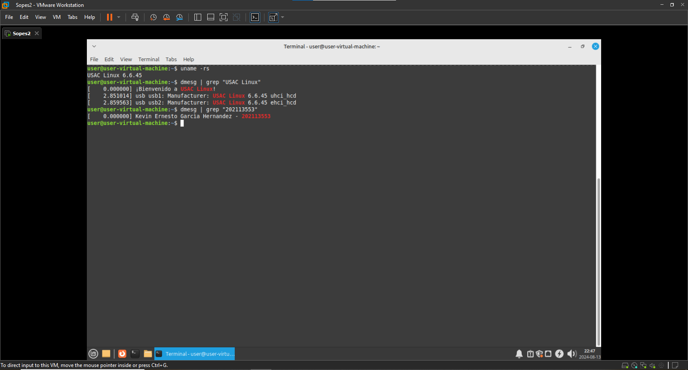

## Llamadas al Sistema

Las llamadas al sistema son la interfaz entre el espacio de usuario y el espacio del kernel. Estas permiten a los programas de usuario solicitar servicios al kernel, como la creación de procesos, la lectura y escritura de archivos, etc.

En este caso, vamos a agregar tres llamadas al sistema personalizadas: **get_current_time**, **get_uptime**, y **get_last_5_kernel_logs**. Estas llamadas al sistema nos permitirán obtener la hora actual, el tiempo de actividad del sistema, y los últimos 5 mensajes del kernel, respectivamente.

### kernel/sys.c

Primero, debemos modificar el archivo **kernel/sys.c** para agregar las implementaciones de nuestras llamadas al sistema. En este archivo, podemos agregar las siguientes funciones al final del archivo:

> **Nota:** De ahora en adelante se usará nano para editar los archivos, pero puedes usar el editor de tu preferencia. Algunos comando útiles de nano son:
>
> - **Ctrl + W**: Buscar texto y con Alt + W de nuevo para buscar la siguiente coincidencia.
> - **Ctrl + END**: Ir al final del archivo.
> - **Ctrl + X**: Salir de nano.

```c
// Librerías existentes...
#include <linux/timekeeping.h>
#include <linux/uaccess.h>
#include <linux/printk.h>
#include <linux/slab.h>
#include <linux/kmsg_dump.h>

// Código existente...
SYSCALL_DEFINE0(get_current_time) {
    struct timespec64 ts;
    ktime_get_real_ts64(&ts);
    return ts.tv_sec;
}

SYSCALL_DEFINE0(get_uptime) {
    struct timespec64 ts;
    ktime_get_boottime_ts64(&ts);
    return ts.tv_sec;
}

SYSCALL_DEFINE2(get_last_5_kernel_logs, char *, buffer, size_t, size) {
    struct kmsg_dump_iter iter;
    char *log_buf;
    size_t len = 0;
    size_t ret;

    if (size < 1)
        return -EINVAL;

    log_buf = kmalloc(size, GFP_KERNEL);
    if (!log_buf)
        return -ENOMEM;

    kmsg_dump_rewind(&iter);

    while (kmsg_dump_get_line(&iter, true, log_buf + len, size - len, &ret)) {
        len += ret;
        if (len >= size || ret == 0)
            break;
    }

    if (copy_to_user(buffer, log_buf, len)) {
        kfree(log_buf);
        return -EFAULT;
    }

    kfree(log_buf);
    return len;
}
```

Una vez que hayamos agregado estas funciones, guardamos los cambios y cerramos el archivo.

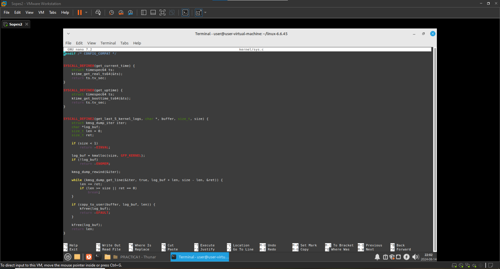

### include/linux/syscalls.h

Luego, debemos modificar el archivo **include/linux/syscalls.h** para agregar las declaraciones de nuestras llamadas al sistema. En este archivo, podemos agregar las siguientes declaraciones al final del archivo:

```c
// Código existente...
asmlinkage long sys_get_current_time(void);
asmlinkage long sys_get_uptime(void);
asmlinkage long sys_get_last_5_kernel_logs(char *buffer, size_t size);
```

Una vez que hayamos agregado estas declaraciones, guardamos los cambios y cerramos el archivo.

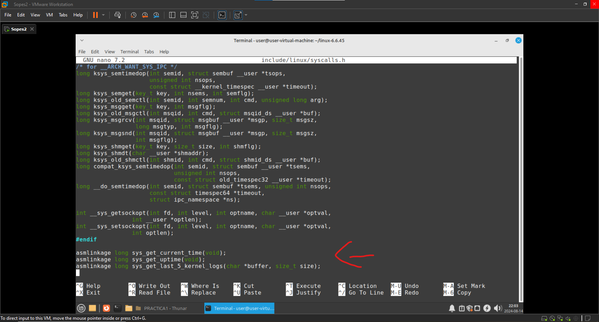

### arch/x86/entry/syscalls/syscall_64.tbl

Finalmente, debemos modificar el archivo **arch/x86/entry/syscalls/syscall_64.tbl** para agregar las definiciones de nuestras llamadas al sistema. En este archivo, podemos agregar las siguientes definiciones al final del archivo:

```c
// Código existente...
548 64 get_current_time sys_get_current_time
549 64 get_uptime sys_get_uptime
550 64 get_last_5_kernel_logs sys_get_last_5_kernel_logs
```

Una vez que hayamos agregado estas definiciones, guardamos los cambios y cerramos el archivo.

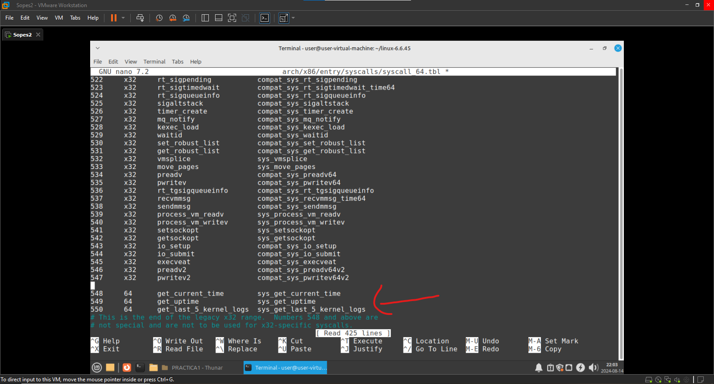

Ya hemos agregado nuestras llamadas al sistema personalizadas. Ahora podemos compilar el kernel y reiniciar el sistema para ver los cambios reflejados.

```bash
# Compilación del kernel
fakeroot make -j4
# Verificar si la compilación fue exitosa
echo $?

# Instalación del kernel
sudo make modules_install
sudo make install

# Reiniciar el sistema
sudo reboot
```

### Aplicación de Usuario

Para probar nuestras llamadas al sistema, podemos crear una aplicación de usuario que haga uso de ellas. Creamos un archivo **test.c** con el siguiente contenido:

```c
#include <stdio.h>
#include <unistd.h>
#include <sys/syscall.h>
#include <linux/kernel.h>

#define SYS_get_current_time 548
#define SYS_get_uptime 549
#define SYS_get_last_5_kernel_logs 550

int main() {
    long current_time = syscall(SYS_get_current_time);
    long uptime = syscall(SYS_get_uptime);
    char buffer[1024];
    long log_size = syscall(SYS_get_last_5_kernel_logs, buffer, sizeof(buffer));

    if (current_time == -1 || uptime == -1 || log_size == -1) {
        perror("syscall");
        return 1;
    }

    printf("Current time: %ld seconds since the epoch\n", current_time);
    printf("Uptime: %ld seconds since last reboot\n", uptime);
    printf("Last 5 kernel logs:\n%s\n", buffer);

    return 0;
}
```

Este programa hace uso de nuestras llamadas al sistema personalizadas para obtener la hora actual, el tiempo de actividad del sistema, y los últimos 5 mensajes del kernel. Una vez que hayamos creado este archivo, lo compilamos con el siguiente comando:

```bash
gcc test.c -o test
```

Luego, ejecutamos el programa con el siguiente comando:

```bash
./test
```

Esto nos mostrará la hora actual, el tiempo de actividad del sistema, y los últimos 5 mensajes del kernel.

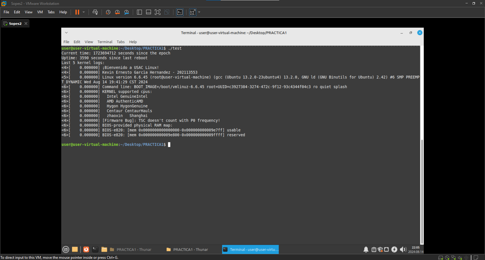

**Y con esto hemos terminado de configurar nuestor kernel para USAC Linux.**

# Errores durante el Desarrollo

A lo largo del desarrollo del kernel de Linux, me he encontrado con varios errores que han surgido durante el proceso. A continuación, se detallan algunos de los errores más comunes y cómo se han solucionado.

## Error de SYSNAME

Este error ocurrió debido a que estaba intentando cambiar el nombre en el archivo incorrecto, siendo este el`binclude/generated/utsrelease.h`. Este archivo se genera automáticamente y no se debe modificar manualmente. El que se debe modificar es el `include/linux/uts.h`.

El no tuvo manera de presentación, pero al no actualizar el nombre del sistema dí por hecho que algo estaba mal.

## Error de las llamadas al sistema

Al principio para agregar las llamadas al sistema, creaba un documento en el directorio `kernel` llamado `usac.c`, aquí añadía mis métodos pero esto no reconocía mis llamadas. Entonces investigué y encontré que debía añadir mis métodos en el archivo `kernel/sys.c`, al final del archivo.

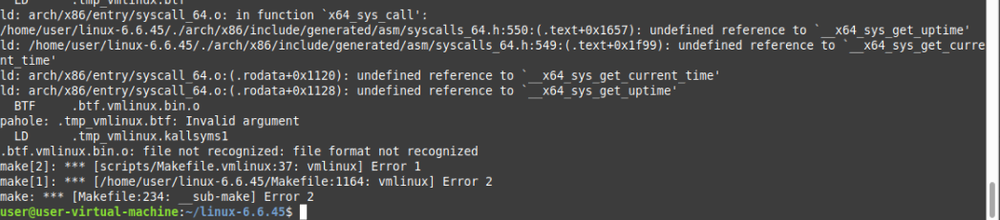

## Error de linux/uptime.h

Este error ocurrió al hacer la llamada al sistema que me permitiría obtener el tiempo de encendido del sistema. El error se presentó debido a que estaba usando `linux/uptime.h`, este no estando incluido en el kernel de Linux. La solución fue usar `linux/uaccess.h` con su respectiva función `ktime_get_boottime_ts64(&ts)`.

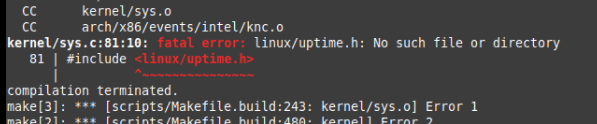

## Error de prb_read_valid()

Este error ocurrió al intentar leer un archivo en el sistema de archivos. El error se presentó debido a que estaba usando `prb_read_valid()`, este no estando incluido en el kernel de Linux. La solución se presentará más adelante.

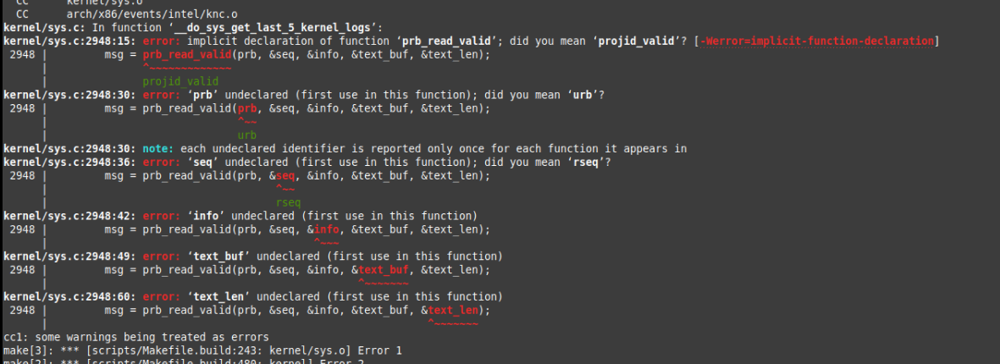

## Error de linux/seq_file.h

Este error ocurrió al intentar escribir en un archivo en el sistema de archivos. El error se presentó debido a que estaba usando `linux/seq_file.h`, este no estando incluido en el kernel de Linux. La solución se presentará más adelante.

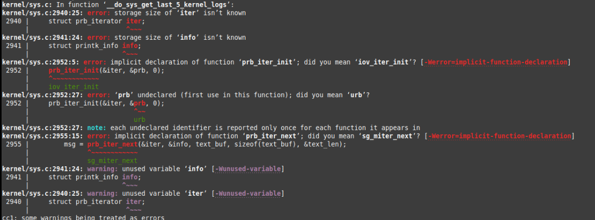

## Error de kmsg_dumper dumper

Este error ocurrió al intentar escribir en un archivo en el sistema de archivos. El error se presentó debido a que estaba usando `kmsg_dumper dumper`, esto por un mal manejo de punteros. La solución finalemnte fue usar la librería `linux/kmsg_dump.h` con la estructura `kmsg_dump_iter iterr` para poder recorrer los mensajes del kernel.

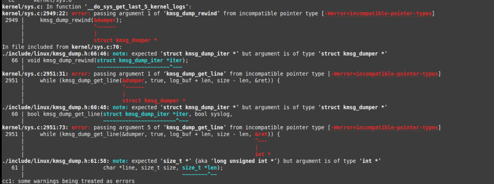
