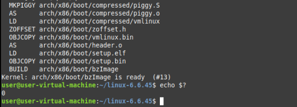
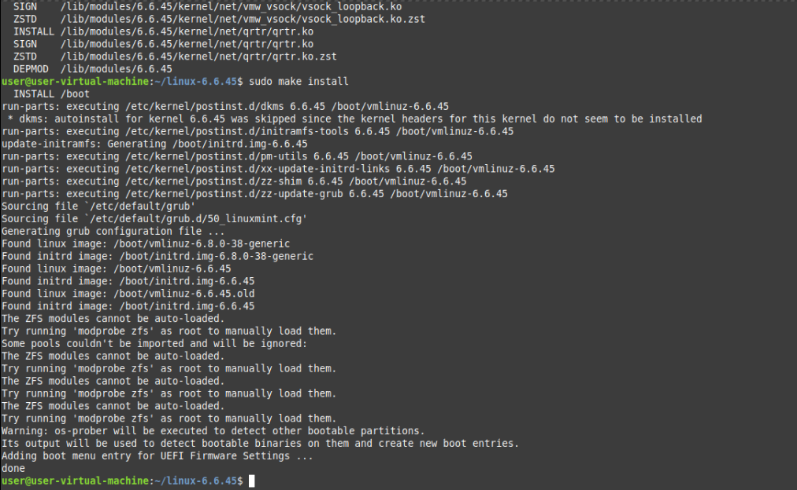
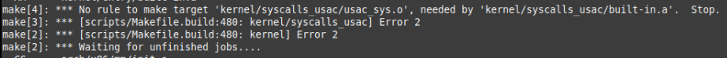
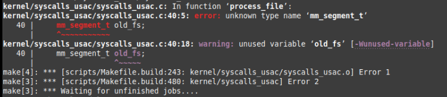
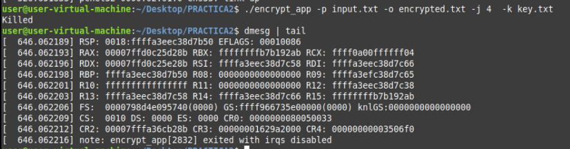

# USAC Linux

Esta es una guía paso a paso para poder encriptar y desencriptar en paralelo un archivo de texto plano utilizando el algoritmo XOR; esto a través de llamadas al sistema implementadas en el kernel de Linux.

## Llamadas al sistema

Para poder realizar la encriptación y desencriptación de un archivo de texto plano, se implementaron dos llamadas al sistema en el kernel de Linux. Primero, vamos a ingresar al directorio donde se encuentra el código fuente del kernel de Linux, en este caso, la versión `6.6.45`. Para ello, ejecutamos el siguiente comando:

```bash
cd linux-6.6.45
```

### syscalls_usac.h

Primero vamos a crear un archivo llamado `syscalls_usac.h` en la carpeta `include/linux`:

```bash
nano include/linux/syscalls_usac.h
```

En este archivo, vamos a definir las llamadas al sistema que se utilizarán para encriptar y desencriptar un archivo de texto plano. A continuación, se muestra el contenido del archivo `syscalls_usac.h`:

```h
#ifndef _SYSCALLS_USAC_H
#define _SYSCALLS_USAC_H

#include <linux/kernel.h>
#include <linux/syscalls.h>

asmlinkage long sys_my_encrypt(const char __user *input_file, const char __user>
asmlinkage long sys_my_decrypt(const char __user *input_file, const char __user>

#endif /* _SYSCALLS_USAC_H */
```

### my_syscalls.c

Ahora creamos un archivo llamado `my_syscalls.c` en la carpeta `kernel`:

```bash
nano kernel/my_syscalls.c
```

En este archivo, vamos a implementar todo el código necesario para las llamadas al sistema. A continuación, se muestra el contenido del archivo `my_syscalls.c`:

```c
#include <linux/syscalls.h> // Encabezado para definiciones de syscalls
#include <linux/fs.h> // Encabezado para operaciones del sistema de archivos
#include <linux/uaccess.h> // Encabezado para acceso a memoria de espacio de usuario
#include <linux/slab.h> // Encabezado para asignación de memoria en el kernel
#include <linux/kthread.h> // Encabezado para hilos del kernel
#include <linux/delay.h> // Encabezado para funciones de demora
#include <linux/syscalls_usac.h> // Encabezado personalizado para definiciones de syscalls

// Estructura para almacenar fragmentos de datos
typedef struct {
    unsigned char *data; // Puntero al buffer de datos
    size_t data_size; // Tamaño del buffer de datos
    unsigned char *key; // Puntero al buffer de clave
    size_t key_size; // Tamaño del buffer de clave
    size_t start; // Índice de inicio del fragmento
    size_t end; // Índice de fin del fragmento
} DataFragment;

// Estructura para almacenar argumentos de la tarea
struct task_parameters {
    DataFragment fragment; // Fragmento de datos a procesar
    struct completion done; // Estructura de finalización para señalar la finalización de la tarea
};

// Función que realiza la operación XOR en un fragmento de datos
int xor_task(void *arg) {
    struct task_parameters *params = (struct task_parameters *)arg; // Convertir argumento a task_parameters
    DataFragment *fragment = &params->fragment; // Obtener el fragmento de datos
    size_t i;

    printk(KERN_INFO "Thread started: start=%zu, end=%zu\n", fragment->start, fragment->end); // Registrar inicio del hilo

    // Realizar operación XOR en el fragmento de datos
    for (i = fragment->start; i < fragment->end; i++) {
        fragment->data[i] ^= fragment->key[i % fragment->key_size];
    }

    printk(KERN_INFO "Thread completed: start=%zu, end=%zu\n", fragment->start, fragment->end); // Registrar finalización del hilo
    complete(&params->done); // Señalar finalización de la tarea
    return 0;
}

// Función que procesa el archivo de entrada y realiza la operación XOR
int process_file(const char *input_path, const char *output_path, const char *key_path, int num_threads) {
    struct file *input_file, *output_file, *key_file; // Punteros a archivos de entrada, salida y clave
    loff_t input_offset = 0, output_offset = 0, key_offset = 0; // Desplazamientos de archivos
    unsigned char *key_buffer, *data_buffer; // Buffers para clave y datos
    size_t input_file_size, key_file_size; // Tamaños de archivos de entrada y clave
    struct task_parameters *task_params; // Array de parámetros de tarea
    struct task_struct **threads; // Array de punteros a hilos
    DataFragment *fragments; // Array de fragmentos de datos
    size_t fragment_size, remainder; // Tamaño de cada fragmento y resto
    int i, ret = 0;

    printk(KERN_INFO "Opening files: input=%s, output=%s, key=%s\n", input_path, output_path, key_path); // Registrar rutas de archivos

    // Abrir archivos de entrada, salida y clave
    input_file = filp_open(input_path, O_RDONLY, 0);
    output_file = filp_open(output_path, O_WRONLY | O_CREAT | O_TRUNC, 0644);
    key_file = filp_open(key_path, O_RDONLY, 0);

    // Comprobar errores al abrir archivos
    if (IS_ERR(input_file)) {
        ret = PTR_ERR(input_file);
        printk(KERN_ERR "Failed to open input file: %d\n", ret);
        goto out;
    }
    if (IS_ERR(output_file)) {
        ret = PTR_ERR(output_file);
        printk(KERN_ERR "Failed to open output file: %d\n", ret);
        goto close_input_file;
    }
    if (IS_ERR(key_file)) {
        ret = PTR_ERR(key_file);
        printk(KERN_ERR "Failed to open key file: %d\n", ret);
        goto close_output_file;
    }

    // Obtener el tamaño del archivo de clave
    key_file_size = i_size_read(file_inode(key_file));
    if (key_file_size <= 0) {
        ret = -EINVAL;
        printk(KERN_ERR "Invalid key size: %zu\n", key_file_size);
        goto close_key_file;
    }

    // Asignar memoria para el buffer de clave
    key_buffer = kmalloc(key_file_size, GFP_KERNEL);
    if (!key_buffer) {
        ret = -ENOMEM;
        printk(KERN_ERR "Failed to allocate memory for key\n");
        goto close_key_file;
    }

    // Leer el archivo de clave en el buffer de clave
    ret = kernel_read(key_file, key_buffer, key_file_size, &key_offset);
    if (ret < 0) {
        printk(KERN_ERR "Failed to read key: %d\n", ret);
        goto free_key_buffer;
    }

    // Obtener el tamaño del archivo de entrada
    input_file_size = i_size_read(file_inode(input_file));
    if (input_file_size <= 0) {
        ret = -EINVAL;
        printk(KERN_ERR "Invalid input file size: %zu\n", input_file_size);
        goto free_key_buffer;
    }

    // Asignar memoria para el buffer de datos
    data_buffer = kmalloc(input_file_size, GFP_KERNEL);
    if (!data_buffer) {
        ret = -ENOMEM;
        printk(KERN_ERR "Failed to allocate memory for data\n");
        goto free_key_buffer;
    }

    // Leer el archivo de entrada en el buffer de datos
    ret = kernel_read(input_file, data_buffer, input_file_size, &input_offset);
    if (ret < 0) {
        printk(KERN_ERR "Failed to read input file: %d\n", ret);
        goto free_data_buffer;
    }

    // Asignar memoria para hilos, parámetros de tarea y fragmentos
    threads = kmalloc(sizeof(struct task_struct *) * num_threads, GFP_KERNEL);
    task_params = kmalloc(sizeof(struct task_parameters) * num_threads, GFP_KERNEL);
    fragments = kmalloc(sizeof(DataFragment) * num_threads, GFP_KERNEL);

    if (!threads || !task_params || !fragments) {
        ret = -ENOMEM;
        printk(KERN_ERR "Failed to allocate memory for threads, task parameters, or fragments.\n");
        goto free_data_buffer;
    }

    // Calcular el tamaño de cada fragmento y el resto
    fragment_size = input_file_size / num_threads;
    remainder = input_file_size % num_threads;

    // Crear hilos para procesar cada fragmento
    for (i = 0; i < num_threads; i++) {
        fragments[i].data = data_buffer; // Establecer buffer de datos
        fragments[i].data_size = input_file_size; // Establecer tamaño de datos
        fragments[i].key = key_buffer; // Establecer buffer de clave
        fragments[i].key_size = key_file_size; // Establecer tamaño de clave
        fragments[i].start = i * fragment_size; // Establecer índice de inicio
        fragments[i].end = (i == num_threads - 1) ? (i + 1) * fragment_size + remainder : (i + 1) * fragment_size; // Establecer índice de fin

        printk(KERN_INFO "Creating thread %d: start=%zu, end=%zu\n", i, fragments[i].start, fragments[i].end); // Registrar creación de hilo

        task_params[i].fragment = fragments[i]; // Establecer fragmento en parámetros de tarea
        init_completion(&task_params[i].done); // Inicializar estructura de finalización

        // Crear y ejecutar el hilo
        threads[i] = kthread_run(xor_task, &task_params[i], "xor_thread_%d", i);
        if (IS_ERR(threads[i])) {
            ret = PTR_ERR(threads[i]);
            printk(KERN_ERR "Failed to create thread %d: %d\n", i, ret);
            goto free_all;
        }
    }

    // Esperar a que todos los hilos completen
    for (i = 0; i < num_threads; i++) {
        printk(KERN_INFO "Waiting for thread %d to complete\n", i); // Registrar espera de hilo
        wait_for_completion(&task_params[i].done); // Esperar a que el hilo complete
    }

    // Escribir los datos procesados en el archivo de salida
    ret = kernel_write(output_file, data_buffer, input_file_size, &output_offset);
    if (ret < 0) {
        printk(KERN_ERR "Failed to write output file: %d\n", ret);
    } else {
        printk(KERN_INFO "Output file written successfully\n"); // Registrar escritura exitosa
    }

free_all:
    kfree(threads); // Liberar memoria para hilos
    kfree(task_params); // Liberar memoria para parámetros de tarea
    kfree(fragments); // Liberar memoria para fragmentos

free_data_buffer:
    kfree(data_buffer); // Liberar memoria para buffer de datos

free_key_buffer:
    kfree(key_buffer); // Liberar memoria para buffer de clave

close_key_file:
    filp_close(key_file, NULL); // Cerrar archivo de clave

close_output_file:
    filp_close(output_file, NULL); // Cerrar archivo de salida

close_input_file:
    filp_close(input_file, NULL); // Cerrar archivo de entrada

out:
    return ret; // Devolver resultado
}

// Definición del syscall my_encrypt
SYSCALL_DEFINE4(my_encrypt, const char __user *, input_path, const char __user *, output_path, const char __user *, key_path, int, num_threads) {
    char *k_input_path, *k_output_path, *k_key_path; // Rutas en espacio de kernel
    int ret;

    printk(KERN_INFO "Entering my_encrypt syscall\n"); // Registrar entrada al syscall

    // Copiar rutas desde espacio de usuario a espacio de kernel
    k_input_path = strndup_user(input_path, PATH_MAX);
    k_output_path = strndup_user(output_path, PATH_MAX);
    k_key_path = strndup_user(key_path, PATH_MAX);

    printk(KERN_INFO "Input file path: %s\n", k_input_path); // Registrar ruta del archivo de entrada
    printk(KERN_INFO "Output file path: %s\n", k_output_path); // Registrar ruta del archivo de salida
    printk(KERN_INFO "Key file path: %s\n", k_key_path); // Registrar ruta del archivo de clave

    // Comprobar errores al copiar rutas
    if (IS_ERR(k_input_path) || IS_ERR(k_output_path) || IS_ERR(k_key_path)) {
        ret = -EFAULT;
        printk(KERN_ERR "Failed to copy paths from user space\n");
        goto out_free;
    }

    // Procesar el archivo con las rutas y el número de hilos dados
    ret = process_file(k_input_path, k_output_path, k_key_path, num_threads);

out_free:
    kfree(k_input_path); // Liberar ruta de entrada en espacio de kernel
    kfree(k_output_path); // Liberar ruta de salida en espacio de kernel
    kfree(k_key_path); // Liberar ruta de clave en espacio de kernel
    return ret; // Devolver resultado
}

// Definición del syscall my_decrypt
SYSCALL_DEFINE4(my_decrypt, const char __user *, input_path, const char __user *, output_path, const char __user *, key_path, int, num_threads) {
    char *k_input_path, *k_output_path, *k_key_path; // Rutas en espacio de kernel
    int ret;

    printk(KERN_INFO "Entering my_decrypt syscall\n"); // Registrar entrada al syscall

    // Copiar rutas desde espacio de usuario a espacio de kernel
    k_input_path = strndup_user(input_path, PATH_MAX);
    k_output_path = strndup_user(output_path, PATH_MAX);
    k_key_path = strndup_user(key_path, PATH_MAX);

    printk(KERN_INFO "Input file path: %s\n", k_input_path); // Registrar ruta del archivo de entrada
    printk(KERN_INFO "Output file path: %s\n", k_output_path); // Registrar ruta del archivo de salida
    printk(KERN_INFO "Key file path: %s\n", k_key_path); // Registrar ruta del archivo de clave

    // Comprobar errores al copiar rutas
    if (IS_ERR(k_input_path) || IS_ERR(k_output_path) || IS_ERR(k_key_path)) {
        ret = -EFAULT;
        printk(KERN_ERR "Failed to copy paths from user space\n");
        goto out_free;
    }

    // Procesar el archivo con las rutas y el número de hilos dados
    ret = process_file(k_input_path, k_output_path, k_key_path, num_threads);

out_free:
    kfree(k_input_path); // Liberar ruta de entrada en espacio de kernel
    kfree(k_output_path); // Liberar ruta de salida en espacio de kernel
    kfree(k_key_path); // Liberar ruta de clave en espacio de kernel
    return ret; // Devolver resultado
}
```

Aquí una explicación de las funciones y estructuras definidas en el archivo `my_syscalls.c`:

```c
// Estructura para almacenar argumentos de la tarea
struct task_parameters {
    DataFragment fragment; // Fragmento de datos a procesar
    struct completion done; // Estructura de finalización para señalar la finalización de la tarea
};
```

La estructura `task_parameters` se utiliza para almacenar los argumentos de una tarea que se ejecutará en un hilo del kernel. Contiene un fragmento de datos a procesar y una estructura de finalización para señalar la finalización de la tarea.

```c
// Función que realiza la operación XOR en un fragmento de datos
int xor_task(void *arg) {
    struct task_parameters *params = (struct task_parameters *)arg; // Convertir argumento a task_parameters
    DataFragment *fragment = &params->fragment; // Obtener el fragmento de datos
    size_t i;

    printk(KERN_INFO "Thread started: start=%zu, end=%zu\n", fragment->start, fragment->end); // Registrar inicio del hilo

    // Realizar operación XOR en el fragmento de datos
    for (i = fragment->start; i < fragment->end; i++) {
        fragment->data[i] ^= fragment->key[i % fragment->key_size];
    }

    printk(KERN_INFO "Thread completed: start=%zu, end=%zu\n", fragment->start, fragment->end); // Registrar finalización del hilo
    complete(&params->done); // Señalar finalización de la tarea
    return 0;
}
```

La función `xor_task` realiza la operación XOR en un fragmento de datos utilizando una clave. Recibe un argumento que contiene un fragmento de datos y una estructura de finalización. Registra el inicio y la finalización del hilo, realiza la operación XOR en el fragmento de datos y señala la finalización de la tarea.

```c
// Función que procesa el archivo de entrada y realiza la operación XOR
int process_file(const char *input_path, const char *output_path, const char *key_path, int num_threads) {
    struct file *input_file, *output_file, *key_file; // Punteros a archivos de entrada, salida y clave
    loff_t input_offset = 0, output_offset = 0, key_offset = 0; // Desplazamientos de archivos
    unsigned char *key_buffer, *data_buffer; // Buffers para clave y datos
    size_t input_file_size, key_file_size; // Tamaños de archivos de entrada y clave
    struct task_parameters *task_params; // Array de parámetros de tarea
    struct task_struct **threads; // Array de punteros a hilos
    DataFragment *fragments; // Array de fragmentos de datos
    size_t fragment_size, remainder; // Tamaño de cada fragmento y resto
    int i, ret = 0;

    printk(KERN_INFO "Opening files: input=%s, output=%s, key=%s\n", input_path, output_path, key_path); // Registrar rutas de archivos

    // Abrir archivos de entrada, salida y clave
    input_file = filp_open(input_path, O_RDONLY, 0);
    output_file = filp_open(output_path, O_WRONLY | O_CREAT | O_TRUNC, 0644);
    key_file = filp_open(key_path, O_RDONLY, 0);

    // Comprobar errores al abrir archivos
    if (IS_ERR(input_file)) {
        ret = PTR_ERR(input_file);
        printk(KERN_ERR "Failed to open input file: %d\n", ret);
        goto out;
    }
    if (IS_ERR(output_file)) {
        ret = PTR_ERR(output_file);
        printk(KERN_ERR "Failed to open output file: %d\n", ret);
        goto close_input_file;
    }
    if (IS_ERR(key_file)) {
        ret = PTR_ERR(key_file);
        printk(KERN_ERR "Failed to open key file: %d\n", ret);
        goto close_output_file;
    }

    // Obtener el tamaño del archivo de clave
    key_file_size = i_size_read(file_inode(key_file));
    if (key_file_size <= 0) {
        ret = -EINVAL;
        printk(KERN_ERR "Invalid key size: %zu\n", key_file_size);
        goto close_key_file;
    }

    // Asignar memoria para el buffer de clave
    key_buffer = kmalloc(key_file_size, GFP_KERNEL);
    if (!key_buffer) {
        ret = -ENOMEM;
        printk(KERN_ERR "Failed to allocate memory for key\n");
        goto close_key_file;
    }

    // Leer el archivo de clave en el buffer de clave
    ret = kernel_read(key_file, key_buffer, key_file_size, &key_offset);
    if (ret < 0) {
        printk(KERN_ERR "Failed to read key: %d\n", ret);
        goto free_key_buffer;
    }

    // Obtener el tamaño del archivo de entrada
    input_file_size = i_size_read(file_inode(input_file));
    if (input_file_size <= 0) {
        ret = -EINVAL;
        printk(KERN_ERR "Invalid input file size: %zu\n", input_file_size);
        goto free_key_buffer;
    }

    // Asignar memoria para el buffer de datos
    data_buffer = kmalloc(input_file_size, GFP_KERNEL);
    if (!data_buffer) {
        ret = -ENOMEM;
        printk(KERN_ERR "Failed to allocate memory for data\n");
        goto free_key_buffer;
    }

    // Leer el archivo de entrada en el buffer de datos
    ret = kernel_read(input_file, data_buffer, input_file_size, &input_offset);
    if (ret < 0) {
        printk(KERN_ERR "Failed to read input file: %d\n", ret);
        goto free_data_buffer;
    }

    // Asignar memoria para hilos, parámetros de tarea y fragmentos
    threads = kmalloc(sizeof(struct task_struct *) * num_threads, GFP_KERNEL);
    task_params = kmalloc(sizeof(struct task_parameters) * num_threads, GFP_KERNEL);
    fragments = kmalloc(sizeof(DataFragment) * num_threads, GFP_KERNEL);

    if (!threads || !task_params || !fragments) {
        ret = -ENOMEM;
        printk(KERN_ERR "Failed to allocate memory for threads, task parameters, or fragments.\n");
        goto free_data_buffer;
    }

    // Calcular el tamaño de cada fragmento y el resto
    fragment_size = input_file_size / num_threads;
    remainder = input_file_size % num_threads;

    // Crear hilos para procesar cada fragmento
    for (i = 0; i < num_threads; i++) {
        fragments[i].data = data_buffer; // Establecer buffer de datos
        fragments[i].data_size = input_file_size; // Establecer tamaño de datos
        fragments[i].key = key_buffer; // Establecer buffer de clave
        fragments[i].key_size = key_file_size; // Establecer tamaño de clave
        fragments[i].start = i * fragment_size; // Establecer índice de inicio
        fragments[i].end = (i == num_threads - 1) ? (i + 1) * fragment_size + remainder : (i + 1) * fragment_size; // Establecer índice de fin

        printk(KERN_INFO "Creating thread %d: start=%zu, end=%zu\n", i, fragments[i].start, fragments[i].end); // Registrar creación de hilo

        task_params[i].fragment = fragments[i]; // Establecer fragmento en parámetros de tarea
        init_completion(&task_params[i].done); // Inicializar estructura de finalización

        // Crear y ejecutar el hilo
        threads[i] = kthread_run(xor_task, &task_params[i], "xor_thread_%d", i);
        if (IS_ERR(threads[i])) {
            ret = PTR_ERR(threads[i]);
            printk(KERN_ERR "Failed to create thread %d: %d\n", i, ret);
            goto free_all;
        }
    }

    // Esperar a que todos los hilos completen
    for (i = 0; i < num_threads; i++) {
        printk(KERN_INFO "Waiting for thread %d to complete\n", i); // Registrar espera de hilo
        wait_for_completion(&task_params[i].done); // Esperar a que el hilo complete
    }

    // Escribir los datos procesados en el archivo de salida
    ret = kernel_write(output_file, data_buffer, input_file_size, &output_offset);
    if (ret < 0) {
        printk(KERN_ERR "Failed to write output file: %d\n", ret);
    } else {
        printk(KERN_INFO "Output file written successfully\n"); // Registrar escritura exitosa
    }

free_all:
    kfree(threads); // Liberar memoria para hilos
    kfree(task_params); // Liberar memoria para parámetros de tarea
    kfree(fragments); // Liberar memoria para fragmentos

free_data_buffer:
    kfree(data_buffer); // Liberar memoria para buffer de datos

free_key_buffer:
    kfree(key_buffer); // Liberar memoria para buffer de clave

close_key_file:
    filp_close(key_file, NULL); // Cerrar archivo de clave

close_output_file:
    filp_close(output_file, NULL); // Cerrar archivo de salida

close_input_file:
    filp_close(input_file, NULL); // Cerrar archivo de entrada

out:
    return ret; // Devolver resultado
}
```

La función `process_file` procesa un archivo de entrada y realiza la operación XOR en paralelo utilizando un número dado de hilos. Abre los archivos de entrada, salida y clave, lee el archivo de clave en un buffer, lee el archivo de entrada en un buffer, asigna memoria para hilos, parámetros de tarea y fragmentos, calcula el tamaño de cada fragmento y el resto, crea hilos para procesar cada fragmento, espera a que todos los hilos completen, escribe los datos procesados en el archivo de salida y libera la memoria utilizada.

```c
// Definición del syscall my_encrypt
SYSCALL_DEFINE4(my_encrypt, const char __user *, input_path, const char __user *, output_path, const char __user *, key_path, int, num_threads) {
    char *k_input_path, *k_output_path, *k_key_path; // Rutas en espacio de kernel
    int ret;

    printk(KERN_INFO "Entering my_encrypt syscall\n"); // Registrar entrada al syscall

    // Copiar rutas desde espacio de usuario a espacio de kernel
    k_input_path = strndup_user(input_path, PATH_MAX);
    k_output_path = strndup_user(output_path, PATH_MAX);
    k_key_path = strndup_user(key_path, PATH_MAX);

    printk(KERN_INFO "Input file path: %s\n", k_input_path); // Registrar ruta del archivo de entrada
    printk(KERN_INFO "Output file path: %s\n", k_output_path); // Registrar ruta del archivo de salida
    printk(KERN_INFO "Key file path: %s\n", k_key_path); // Registrar ruta del archivo de clave

    // Comprobar errores al copiar rutas
    if (IS_ERR(k_input_path) || IS_ERR(k_output_path) || IS_ERR(k_key_path)) {
        ret = -EFAULT;
        printk(KERN_ERR "Failed to copy paths from user space\n");
        goto out_free;
    }

    // Procesar el archivo con las rutas y el número de hilos dados
    ret = process_file(k_input_path, k_output_path, k_key_path, num_threads);

out_free:
    kfree(k_input_path); // Liberar ruta de entrada en espacio de kernel
    kfree(k_output_path); // Liberar ruta de salida en espacio de kernel
    kfree(k_key_path); // Liberar ruta de clave en espacio de kernel
    return ret; // Devolver resultado
}
```

La llamada al sistema `my_encrypt` recibe las rutas de los archivos de entrada, salida y clave, así como el número de hilos a utilizar. Registra la entrada al syscall, copia las rutas desde el espacio de usuario al espacio de kernel, procesa el archivo con las rutas y el número de hilos dados y devuelve el resultado.

```c
// Definición del syscall my_decrypt
SYSCALL_DEFINE4(my_decrypt, const char __user *, input_path, const char __user *, output_path, const char __user *, key_path, int, num_threads) {
    char *k_input_path, *k_output_path, *k_key_path; // Rutas en espacio de kernel
    int ret;

    printk(KERN_INFO "Entering my_decrypt syscall\n"); // Registrar entrada al syscall

    // Copiar rutas desde espacio de usuario a espacio de kernel
    k_input_path = strndup_user(input_path, PATH_MAX);
    k_output_path = strndup_user(output_path, PATH_MAX);
    k_key_path = strndup_user(key_path, PATH_MAX);

    printk(KERN_INFO "Input file path: %s\n", k_input_path); // Registrar ruta del archivo de entrada
    printk(KERN_INFO "Output file path: %s\n", k_output_path); // Registrar ruta del archivo de salida
    printk(KERN_INFO "Key file path: %s\n", k_key_path); // Registrar ruta del archivo de clave

    // Comprobar errores al copiar rutas
    if (IS_ERR(k_input_path) || IS_ERR(k_output_path) || IS_ERR(k_key_path)) {
        ret = -EFAULT;
        printk(KERN_ERR "Failed to copy paths from user space\n");
        goto out_free;
    }

    // Procesar el archivo con las rutas y el número de hilos dados
    ret = process_file(k_input_path, k_output_path, k_key_path, num_threads);

out_free:
    kfree(k_input_path); // Liberar ruta de entrada en espacio de kernel
    kfree(k_output_path); // Liberar ruta de salida en espacio de kernel
    kfree(k_key_path); // Liberar ruta de clave en espacio de kernel
    return ret; // Devolver resultado
}
```

#### Makefile

Para compilar el módulo del kernel que contiene las llamadas al sistema, se debe agregar una regla al archivo `Makefile` en la carpeta `kernel`:

```bash
nano kernel/Makefile
```

Agregamos la siguiente regla al final del archivo `Makefile`:

```makefile
## Código existente...

obj-y    = fork.o exec_domain.o panic.o \
            cpu.o exit.o softirq.o resource.o \
            sysctl.o capability.o ptrace.o user.o \
            signal.o sys.o umh.o workqueue.o pid.o task_work.o \
            extable.o params.o \
            kthread.o sys_ni.o nsproxy.o \
            notifier.o ksysfs.o cred.o reboot.o \
            async.o range.o smpboot.o ucount.o regset.o ksyms_common.o \
            my_syscalls.o  # Aquí se agrega el archivo my_syscalls.c

## Código existente...
```

### syscalls.h

Para que el kernel pueda reconocer las llamadas al sistema que se han definido, es necesario agregar una referencia a estas en el archivo `syscalls.h` en la carpeta `include/linux`:

```bash
nano include/linux/syscalls.h
```

Agregamos las siguientes líneas al final del archivo `syscalls.h`:

```c
// Código existente...

asmlinkage long sys_my_encrypt(const char __user *input_file, const char __user *output_file, int num_threads, const char __user *key_file);
asmlinkage long sys_my_decrypt(const char __user *input_file, const char __user *output_file, int num_threads, const char __user *key_file);

#endif
```

### syscall_64.tbl

Para que el kernel pueda asignar un número de syscall a las llamadas al sistema que se han definido, es necesario agregar una referencia a estas en el archivo `syscall_64.tbl` en la carpeta `arch/x86/entry/syscalls`:

```bash
nano arch/x86/entry/syscalls/syscall_64.tbl
```

Agregamos las siguientes líneas al archivo `syscall_64.tbl`:

> **Nota:** En mi caso los asignaré antes de la llamada 512, por lo cuál tener en cuenta el correlativo de las llamadas al sistema.

```c
// Código existente...

454     64      my_encrypt              sys_my_encrypt
455     64      my_decrypt              sys_my_decrypt

// Código existente...
```

## Compilación e instalación del módulo del kernel

Para compilar e instalar el módulo del kernel que contiene las llamadas al sistema, se deben seguir los siguientes pasos:

### Configuración del kernel

Vamos a obtener el `.config` del kernel actual para poder compilar el módulo con la misma configuración:

```bash
cp -v /boot/config-$(uname -r) .config
```

Sin embargo, este esta lleno de modulos y drivers que no necesitamos que pueden aumentar el tiempo de compilación. Por lo que utilizamos el comando localmodconfig que analiza los módulos del kernel cargados de su sistema y modifica el archivo `.config` de modo que solo estos módulos se incluyan en la compilación. Tomar en cuenta que esto causará que nuestro kernel compilado solo funcione en nuestra máquina.

```bash
make localmodconfig
```

Luego tenemos que modificar el `.config`, ya que al copiar nuestro .config se incluyeron nuestras llaves privadas, por lo que tendremos que reliminarlas del `.config`.

```bash
scripts/config --disable SYSTEM_TRUSTED_KEYS
scripts/config --disable SYSTEM_REVOCATION_KEYS
scripts/config --set-str CONFIG_SYSTEM_TRUSTED_KEYS ""
scripts/config --set-str CONFIG_SYSTEM_REVOCATION_KEYS ""
```

### Compilación del kernel

Ahora vamos a compilar el kernel, para ello ejecutamos los siguientes comandos:

```bash
# Usar todos los núcleos disponibles
fakeroot make -j$(nproc)

# Usar n núcleos
fakeroot make -jn
```

FakeRoot es una herramienta que permite ejecutar comandos como root sin tener privilegios de superusuario. Esto es necesario para la compilación del kernel. También se utiliza el comando `-j$(nproc)` para que la compilación se realice en paralelo, utilizando todos los núcleos de nuestro procesador. Otra opción es utilizar `-jn` para especificar el número de núcleos a utilizar.

Una vez que la compilación haya finalizado, aparecerá un mensaje indicando que el kernel se ha compilado correctamente. También podría verificarlo con el siguiente comando:

```bash
echo $?
```

Si el comando anterior devuelve `0`, significa que la compilación fue exitosa.



### Instalación del módulo del kernel

Para instalar el kernel, ejecutamos el siguiente comando para instalar los módulos del kernel:

```bash
sudo make modules_install
```

Luego, ejecutamos el siguiente comando para instalar el kernel:

```bash
sudo make install
```



Una vez que la instalación haya finalizado, reiniciamos el sistema para que los cambios surtan efecto:

```bash
sudo reboot
```

## Aplicación de las llamadas al sistema

Para aplicar las llamadas al sistema que se han definido, se puede utilizar un programa en C que haga uso de estas llamadas. A continuación, se muestra un ejemplo de un programa en C que encripta y desencripta un archivo de texto plano utilizando las llamadas al sistema `my_encrypt` y `my_decrypt`:

`encrypt_app`

```c
#include <stdio.h>
#include <stdlib.h>
#include <unistd.h>
#include <sys/syscall.h>
#include <errno.h>

#define SYS_MY_ENCRYPT 454

void print_usage(const char *prog_name) {
    fprintf(stderr, "Usage: %s -p <input_file_path> -o <output_file_path> -j <num_threads> -k <key_file_path>\n", prog_name);
}

int main(int argc, char *argv[]) {
    char *input_file = NULL;
    char *output_file = NULL;
    char *key_file = NULL;
    int num_threads = 0;
    int opt;

    while ((opt = getopt(argc, argv, "p:o:j:k:")) != -1) {
        switch (opt) {
            case 'p':
                input_file = optarg;
                break;
            case 'o':
                output_file = optarg;
                break;
            case 'j':
                num_threads = atoi(optarg);
                break;
            case 'k':
                key_file = optarg;
                break;
            default:
                print_usage(argv[0]);
                return EXIT_FAILURE;
        }
    }

    if (!input_file || !output_file || !key_file || num_threads <= 0) {
        print_usage(argv[0]);
        return EXIT_FAILURE;
    }

    long ret = syscall(SYS_MY_ENCRYPT, input_file, output_file, key_file, num_threads);
    if (ret < 0) {
        perror("syscall");
        return EXIT_FAILURE;
    }

    printf("Encryption successful\n");
    return EXIT_SUCCESS;
}
```

`decrypt_app`

```c
#include <stdio.h>
#include <stdlib.h>
#include <unistd.h>
#include <sys/syscall.h>
#include <errno.h>

#define SYS_MY_DECRYPT 455

void print_usage(const char *prog_name) {
    fprintf(stderr, "Usage: %s -p <input_file_path> -o <output_file_path> -j <num_threads> -k <key_file_path>\n", prog_name);
}

int main(int argc, char *argv[]) {
    char *input_file = NULL;
    char *output_file = NULL;
    char *key_file = NULL;
    int num_threads = 0;
    int opt;

    while ((opt = getopt(argc, argv, "p:o:j:k:")) != -1) {
        switch (opt) {
            case 'p':
                input_file = optarg;
                break;
            case 'o':
                output_file = optarg;
                break;
            case 'j':
                num_threads = atoi(optarg);
                break;
            case 'k':
                key_file = optarg;
                break;
            default:
                print_usage(argv[0]);
                return EXIT_FAILURE;
        }
    }

    if (!input_file || !output_file || !key_file || num_threads <= 0) {
        print_usage(argv[0]);
        return EXIT_FAILURE;
    }

    long ret = syscall(SYS_MY_DECRYPT, input_file, output_file, key_file, num_threads);
    if (ret < 0) {
        perror("syscall");
        return EXIT_FAILURE;
    }

    printf("Decryption successful\n");
    return EXIT_SUCCESS;
}
```

Y para compilar los programas, se puede utilizar el siguiente comando:

```bash
gcc -o encrypt_app encrypt_app.c
gcc -o decrypt_app decrypt_app.c
```

Para ejecutar el programa de encriptación, se puede utilizar el siguiente comando:

```bash
./encrypt_app -p input.txt -o encrypted.txt -j 4 -k key.txt
```

Para ejecutar el programa de desencriptación, se puede utilizar el siguiente comando:

```bash
./decrypt_app -p encrypted.txt -o decrypted.txt -j 4 -k key.txt
```

Donde `input.txt` es el archivo de entrada, `encrypted.txt` es el archivo de salida encriptado, `decrypted.txt` es el archivo de salida desencriptado y `key.txt` es el archivo de clave.

## Troubleshooting

Durante el desarrollo de este proyecto, me encontré con varios problemas que me llevaron a investigar y probar diferentes soluciones. A continuación, se presentan algunos sus soluciones:

### Error del Makefile



Esto fue ya que no había agregado la compilación del archivo `usac_sys.c` en el archivo `Makefile`. Esto lo tenía que agregar en la sección de `obj-y`. Este error me lo dio cuando trataba de implementar las llamadas al sistema de una forma diferente.

### Error de compilación



Este error indica que el compilador no reconoce el tipo 'mm_segment_t'. Para solucionar este problema, se debe incluir el archivo de encabezado 'linux/uaccess.h' en el archivo 'my_syscalls.c'.

### Error Killed



Al ejecutar el programa de usuario, se produjo un error "Killed". Esto se debió a que el tamaño del fragmento era demasiado grande y causaba un error de memoria. Para solucionar este problema, refactoricé nuevamente todo el código.
