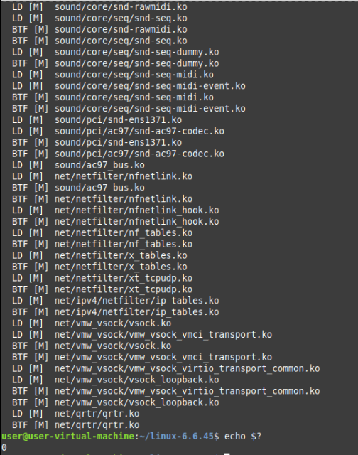
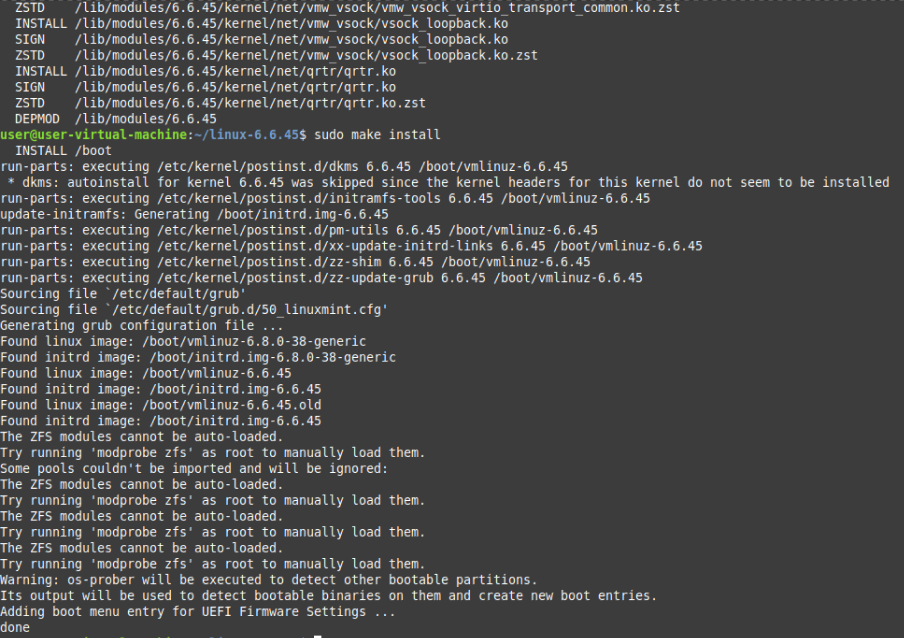
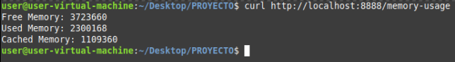
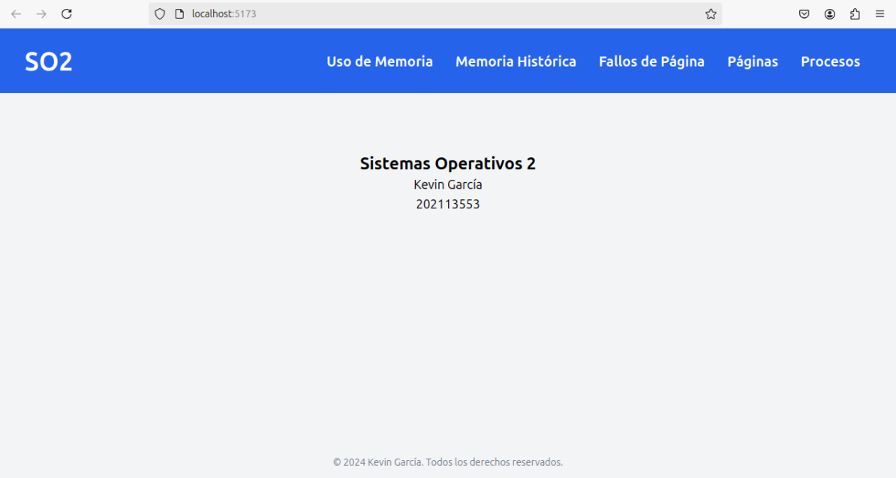
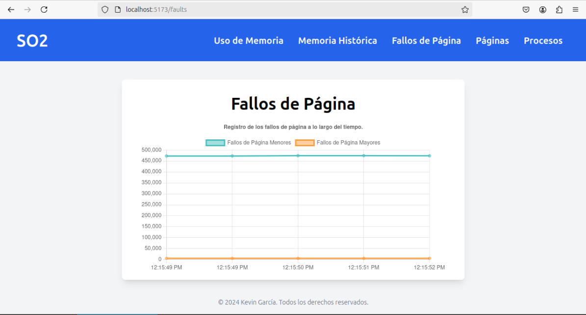
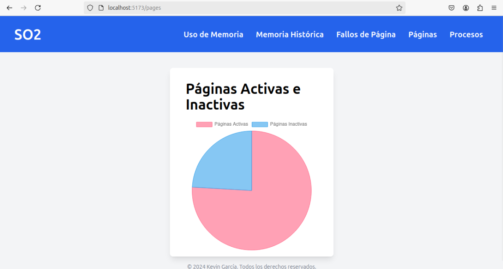
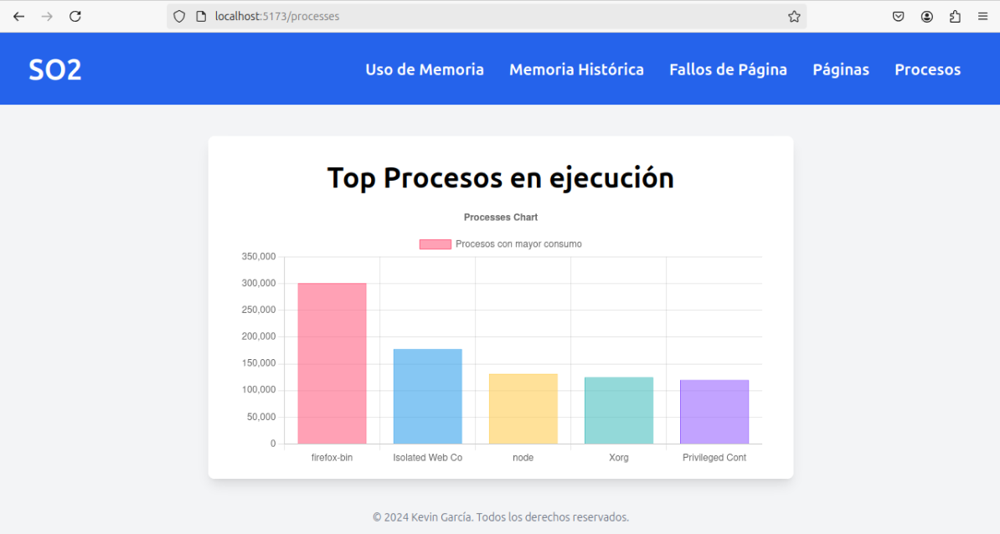
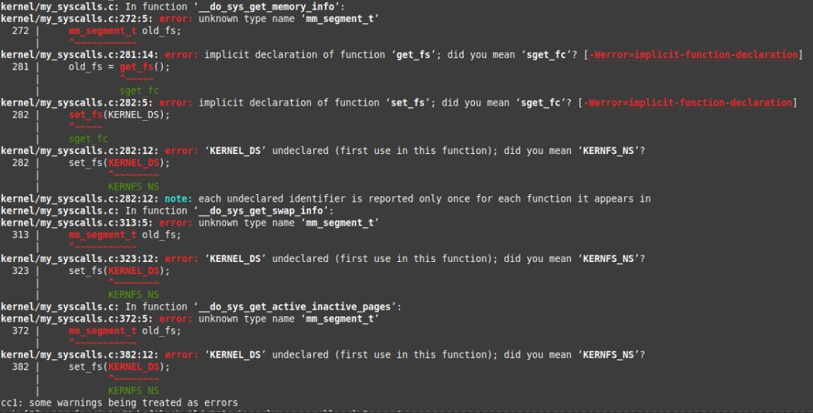
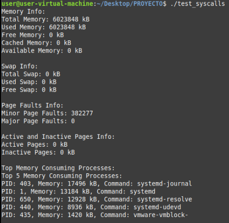

# USAC Linux

Esta es una guía paso a paso para poder realizar llamadas al sistema en nuestro kernel para monitorear el uso de memoria de nuestro sistema.

## Llamadas al sistema

Para poder obtener información del sistema, se crearon dos llamadas al sistema, una para obtener la cantidad de memoria libre y otra para obtener la cantidad de memoria total. Primero, vamos a ingresar al directorio donde se encuentra el código fuente del kernel de Linux, en este caso, la versión `6.6.45`. Para ello, ejecutamos el siguiente comando:

```bash
cd linux-6.6.45
```

### my_syscalls.c

Ahora vamos a implementar las llamadas al sistema. Para ello, vamos a ingresar al archivo llamado `my_syscalls.c` en la carpeta `kernel` del directorio del kernel.

```bash
code kernel/my_syscalls.c
```

En este archivo, vamos a definir las llamadas al sistema y las funciones que se encargarán de obtener la información de la memoria. A continuación, se muestra el contenido del archivo `my_syscalls.c`:

```c
#include <linux/kernel.h>
#include <linux/syscalls.h>
#include <linux/uaccess.h>
#include <linux/slab.h>
#include <linux/sched.h>
#include <linux/mm.h>
#include <linux/swap.h>
#include <linux/sort.h>
#include <linux/fs.h>
#include <linux/fdtable.h>
#include <linux/kthread.h>
#include <linux/delay.h>
#include <linux/syscalls_usac.h>

#define MEMINFO_BUFFER_SIZE 1024

// ---------------- PRACTICA 2 ----------------

// Structure to store data fragments
typedef struct {
    unsigned char *data;
    size_t data_size;
    unsigned char *key;
    size_t key_size;
    size_t start;
    size_t end;
} DataFragment;

// Structure to store task arguments
struct task_parameters {
    DataFragment fragment;
    struct completion done;
};

// ---------------- PROYECTO ----------------

// Definir la estructura process_mem_info para almacenar información de procesos
struct process_mem_info {
    pid_t pid;                // Identificador del proceso
    unsigned long mem_usage;  // Uso de memoria del proceso en bytes
    char comm[TASK_COMM_LEN]; // Nombre del comando asociado al proceso
};

// ---------------- PRACTICA 2 ----------------

// Function that performs the XOR operation on a data fragment
int xor_task(void *arg) {
    struct task_parameters *params = (struct task_parameters *)arg;
    DataFragment *fragment = &params->fragment;
    size_t i;

    printk(KERN_INFO "Thread started: start=%zu, end=%zu\n", fragment->start, fragment->end);

    for (i = fragment->start; i < fragment->end; i++) {
        fragment->data[i] ^= fragment->key[i % fragment->key_size];
    }

    printk(KERN_INFO "Thread completed: start=%zu, end=%zu\n", fragment->start, fragment->end);
    complete(&params->done);
    return 0;
}

// Function that processes the input file and performs the XOR operation
int process_file(const char *input_path, const char *output_path, const char *key_path, int num_threads) {
    struct file *input_file, *output_file, *key_file;
    loff_t input_offset = 0, output_offset = 0, key_offset = 0;
    unsigned char *key_buffer, *data_buffer;
    size_t input_file_size, key_file_size;
    struct task_parameters *task_params;
    struct task_struct **threads;
    DataFragment *fragments;
    size_t fragment_size, remainder;
    int i, ret = 0;

    printk(KERN_INFO "Opening files: input=%s, output=%s, key=%s\n", input_path, output_path, key_path);

    input_file = filp_open(input_path, O_RDONLY, 0);
    output_file = filp_open(output_path, O_WRONLY | O_CREAT | O_TRUNC, 0644);
    key_file = filp_open(key_path, O_RDONLY, 0);

    if (IS_ERR(input_file)) {
        ret = PTR_ERR(input_file);
        printk(KERN_ERR "Failed to open input file: %d\n", ret);
        goto out;
    }
    if (IS_ERR(output_file)) {
        ret = PTR_ERR(output_file);
        printk(KERN_ERR "Failed to open output file: %d\n", ret);
        goto close_input_file;
    }
    if (IS_ERR(key_file)) {
        ret = PTR_ERR(key_file);
        printk(KERN_ERR "Failed to open key file: %d\n", ret);
        goto close_output_file;
    }

    key_file_size = i_size_read(file_inode(key_file));
    if (key_file_size <= 0) {
        ret = -EINVAL;
        printk(KERN_ERR "Invalid key size: %zu\n", key_file_size);
        goto close_key_file;
    }

    key_buffer = kmalloc(key_file_size, GFP_KERNEL);
    if (!key_buffer) {
        ret = -ENOMEM;
        printk(KERN_ERR "Failed to allocate memory for key\n");
        goto close_key_file;
    }

    ret = kernel_read(key_file, key_buffer, key_file_size, &key_offset);
    if (ret < 0) {
        printk(KERN_ERR "Failed to read key: %d\n", ret);
        goto free_key_buffer;
    }

    input_file_size = i_size_read(file_inode(input_file));
    if (input_file_size <= 0) {
        ret = -EINVAL;
        printk(KERN_ERR "Invalid input file size: %zu\n", input_file_size);
        goto free_key_buffer;
    }

    data_buffer = kmalloc(input_file_size, GFP_KERNEL);
    if (!data_buffer) {
        ret = -ENOMEM;
        printk(KERN_ERR "Failed to allocate memory for data\n");
        goto free_key_buffer;
    }

    ret = kernel_read(input_file, data_buffer, input_file_size, &input_offset);
    if (ret < 0) {
        printk(KERN_ERR "Failed to read input file: %d\n", ret);
        goto free_data_buffer;
    }

    // Allocate memory for threads, task parameters, and fragments
    threads = kmalloc(sizeof(struct task_struct *) * num_threads, GFP_KERNEL);
    task_params = kmalloc(sizeof(struct task_parameters) * num_threads, GFP_KERNEL);
    fragments = kmalloc(sizeof(DataFragment) * num_threads, GFP_KERNEL);

    if (!threads || !task_params || !fragments) {
        ret = -ENOMEM;
        printk(KERN_ERR "Failed to allocate memory for threads, task parameters, or fragments.\n");
        goto free_data_buffer;
    }

    fragment_size = input_file_size / num_threads;
    remainder = input_file_size % num_threads;

    for (i = 0; i < num_threads; i++) {
        fragments[i].data = data_buffer;
        fragments[i].data_size = input_file_size;
        fragments[i].key = key_buffer;
        fragments[i].key_size = key_file_size;
        fragments[i].start = i * fragment_size;
        fragments[i].end = (i == num_threads - 1) ? (i + 1) * fragment_size + remainder : (i + 1) * fragment_size;

        printk(KERN_INFO "Creating thread %d: start=%zu, end=%zu\n", i, fragments[i].start, fragments[i].end);

        task_params[i].fragment = fragments[i];
        init_completion(&task_params[i].done);

        threads[i] = kthread_run(xor_task, &task_params[i], "xor_thread_%d", i);
        if (IS_ERR(threads[i])) {
            ret = PTR_ERR(threads[i]);
            printk(KERN_ERR "Failed to create thread %d: %d\n", i, ret);
            goto free_all;
        }
    }

    // Wait for all threads to complete
    for (i = 0; i < num_threads; i++) {
        printk(KERN_INFO "Waiting for thread %d to complete\n", i);
        wait_for_completion(&task_params[i].done);
    }

    ret = kernel_write(output_file, data_buffer, input_file_size, &output_offset);
    if (ret < 0) {
        printk(KERN_ERR "Failed to write output file: %d\n", ret);
    } else {
        printk(KERN_INFO "Output file written successfully\n");
    }

free_all:
    kfree(threads);
    kfree(task_params);
    kfree(fragments);

free_data_buffer:
    kfree(data_buffer);

free_key_buffer:
    kfree(key_buffer);

close_key_file:
    filp_close(key_file, NULL);

close_output_file:
    filp_close(output_file, NULL);

close_input_file:
    filp_close(input_file, NULL);

out:
    return ret;
}

// Definition of the my_encrypt syscall
SYSCALL_DEFINE4(my_encrypt, const char __user *, input_path, const char __user *, output_path, const char __user *, key_path, int, num_threads) {
    char *k_input_path, *k_output_path, *k_key_path;
    int ret;

    printk(KERN_INFO "Entering my_encrypt syscall\n");

    k_input_path = strndup_user(input_path, PATH_MAX);
    k_output_path = strndup_user(output_path, PATH_MAX);
    k_key_path = strndup_user(key_path, PATH_MAX);

    printk(KERN_INFO "Input file path: %s\n", k_input_path);
    printk(KERN_INFO "Output file path: %s\n", k_output_path);
    printk(KERN_INFO "Key file path: %s\n", k_key_path);

    if (IS_ERR(k_input_path) || IS_ERR(k_output_path) || IS_ERR(k_key_path)) {
        ret = -EFAULT;
        printk(KERN_ERR "Failed to copy paths from user space\n");
        goto out_free;
    }

    ret = process_file(k_input_path, k_output_path, k_key_path, num_threads);

out_free:
    kfree(k_input_path);
    kfree(k_output_path);
    kfree(k_key_path);
    return ret;
}

// Definition of the my_decrypt syscall
SYSCALL_DEFINE4(my_decrypt, const char __user *, input_path, const char __user *, output_path, const char __user *, key_path, int, num_threads) {
    char *k_input_path, *k_output_path, *k_key_path;
    int ret;

    printk(KERN_INFO "Entering my_decrypt syscall\n");

    k_input_path = strndup_user(input_path, PATH_MAX);
    k_output_path = strndup_user(output_path, PATH_MAX);
    k_key_path = strndup_user(key_path, PATH_MAX);

    printk(KERN_INFO "Input file path: %s\n", k_input_path);
    printk(KERN_INFO "Output file path: %s\n", k_output_path);
    printk(KERN_INFO "Key file path: %s\n", k_key_path);

    if (IS_ERR(k_input_path) || IS_ERR(k_output_path) || IS_ERR(k_key_path)) {
        ret = -EFAULT;
        printk(KERN_ERR "Failed to copy paths from user space\n");
        goto out_free;
    }

    ret = process_file(k_input_path, k_output_path, k_key_path, num_threads);

out_free:
    kfree(k_input_path);
    kfree(k_output_path);
    kfree(k_key_path);
    return ret;
}

// ---------------- PROYECTO ----------------

// Definir la syscall get_memory_info con un argumento de tipo char __user *
SYSCALL_DEFINE1(get_memory_info, char __user *, buffer) {
    struct sysinfo si;
    char *kbuffer;
    int ret = 0;

    // Asignar memoria para kbuffer
    kbuffer = kmalloc(256, GFP_KERNEL);
    if (!kbuffer) return -ENOMEM;

    // Obtener información de memoria
    si_meminfo(&si);

    // Calcular memoria libre, usada y en caché
    unsigned long free_mem = si.freeram * si.mem_unit;
    unsigned long used_mem = (si.totalram - si.freeram) * si.mem_unit;
    unsigned long cached_mem = global_node_page_state(NR_FILE_PAGES) * PAGE_SIZE;

    // Formatear los datos de memoria en kbuffer
    snprintf(kbuffer, 256, "Free Memory: %lu\nUsed Memory: %lu\nCached Memory: %lu\n",
             free_mem / 1024, used_mem / 1024, cached_mem / 1024);

    // Copiar los datos al espacio de usuario
    if (copy_to_user(buffer, kbuffer, 256)) ret = -EFAULT;

    // Liberar la memoria asignada a kbuffer
    kfree(kbuffer);
    return ret;
}

// Definir la syscall get_swap_info con un argumento de tipo char __user *
SYSCALL_DEFINE1(get_swap_info, char __user *, buffer) {
    char *kbuffer;
    struct file *file;
    loff_t pos = 0;
    char *meminfo_buffer;
    unsigned long total_swap = 0, free_swap = 0;
    int bytes_read, ret = 0;

    // Asignar memoria para kbuffer
    kbuffer = kmalloc(256, GFP_KERNEL);
    if (!kbuffer) return -ENOMEM;

    // Asignar memoria para meminfo_buffer
    meminfo_buffer = kmalloc(MEMINFO_BUFFER_SIZE, GFP_KERNEL);
    if (!meminfo_buffer) {
        kfree(kbuffer);
        return -ENOMEM;
    }

    // Abrir el archivo /proc/meminfo en modo solo lectura
    file = filp_open("/proc/meminfo", O_RDONLY, 0);
    if (IS_ERR(file)) {
        kfree(kbuffer);
        kfree(meminfo_buffer);
        return PTR_ERR(file);
    }

    // Leer el contenido del archivo /proc/meminfo
    bytes_read = kernel_read(file, meminfo_buffer, MEMINFO_BUFFER_SIZE, &pos);
    if (bytes_read < 0) {
        kfree(kbuffer);
        kfree(meminfo_buffer);
        filp_close(file, NULL);
        return bytes_read;
    }

    // Extraer los valores de SwapTotal y SwapFree del contenido leído
    sscanf(strstr(meminfo_buffer, "SwapTotal:"), "SwapTotal: %lu", &total_swap);
    sscanf(strstr(meminfo_buffer, "SwapFree:"), "SwapFree: %lu", &free_swap);

    // Cerrar el archivo y liberar la memoria asignada a meminfo_buffer
    filp_close(file, NULL);
    kfree(meminfo_buffer);

    // Formatear los datos de swap en kbuffer
    snprintf(kbuffer, 256, "Total Swap: %lu\nUsed Swap: %lu\nFree Swap: %lu\n",
             total_swap, total_swap - free_swap, free_swap);

    // Copiar los datos al espacio de usuario
    if (copy_to_user(buffer, kbuffer, 256)) ret = -EFAULT;

    // Liberar la memoria asignada a kbuffer
    kfree(kbuffer);
    return ret;
}

// Definir la syscall get_page_faults con un argumento de tipo char __user *
SYSCALL_DEFINE1(get_page_faults, char __user *, buffer) {
    char *kbuffer;
    int ret = 0;
    unsigned long minor_faults = 0;
    unsigned long major_faults = 0;
    struct task_struct *task;

    // Asignar memoria para kbuffer
    kbuffer = kmalloc(256, GFP_KERNEL);
    if (!kbuffer) return -ENOMEM;

    // Recorre todos los procesos para sumar los fallos de página menores y mayores
    for_each_process(task) {
        if (task->mm) {
            minor_faults += task->min_flt;
            major_faults += task->maj_flt;
        }
    }

    // Formatear los datos de fallos de página menores y mayores en kbuffer
    snprintf(kbuffer, 256, "Minor Page Faults: %lu\nMajor Page Faults: %lu\n",
             minor_faults, major_faults);

    // Copiar los datos al espacio de usuario
    if (copy_to_user(buffer, kbuffer, 256)) ret = -EFAULT;

    // Liberar la memoria asignada a kbuffer
    kfree(kbuffer);
    return ret;
}

// Definir la syscall get_active_inactive_pages con un argumento de tipo char __user *
SYSCALL_DEFINE1(get_active_inactive_pages, char __user *, buffer) {
    char *kbuffer;
    int ret = 0;
    unsigned long active = 0;
    unsigned long inactive = 0;

    // Asignar memoria para kbuffer
    kbuffer = kmalloc(256, GFP_KERNEL);
    if (!kbuffer) return -ENOMEM;

    // Obtener la información de páginas activas e inactivas
    active = global_node_page_state(NR_ACTIVE_ANON) + global_node_page_state(NR_ACTIVE_FILE);
    inactive = global_node_page_state(NR_INACTIVE_ANON) + global_node_page_state(NR_INACTIVE_FILE);

    // Formatear los datos de páginas activas e inactivas en kbuffer
    snprintf(kbuffer, 256, "Active Pages: %lu\nInactive Pages: %lu\n",
             active * (PAGE_SIZE / 1024), inactive * (PAGE_SIZE / 1024));

    // Copiar los datos al espacio de usuario
    if (copy_to_user(buffer, kbuffer, 256)) ret = -EFAULT;

    // Liberar la memoria asignada a kbuffer
    kfree(kbuffer);
    return ret;
}

// Definir la syscall get_top_memory_processes con un argumento de tipo char __user *
SYSCALL_DEFINE1(get_top_memory_processes, char __user *, buffer) {
    struct task_struct *task;
    struct process_mem_info top_processes[5];
    char *kbuffer;
    int i, ret = 0;

    // Inicializar la estructura top_processes con ceros
    memset(top_processes, 0, sizeof(top_processes));

    // Asignar memoria para kbuffer
    kbuffer = kmalloc(1024, GFP_KERNEL);
    if (!kbuffer) return -ENOMEM;

    // Bloquear lectura de RCU
    rcu_read_lock();
    // Recorrer todos los procesos
    for_each_process(task) {
        if (task->mm) {
            // Obtener el uso de memoria del proceso
            unsigned long mem = get_mm_rss(task->mm) << PAGE_SHIFT;

            // Insertar el proceso en la lista de los 5 procesos con mayor uso de memoria
            for (i = 0; i < 5; i++) {
                if (mem > top_processes[i].mem_usage) {
                    if (i < 4) {
                        memmove(&top_processes[i + 1], &top_processes[i], (4 - i) * sizeof(struct process_mem_info));
                    }
                    top_processes[i].pid = task->pid;
                    strncpy(top_processes[i].comm, task->comm, sizeof(top_processes[i].comm) - 1);
                    top_processes[i].comm[sizeof(top_processes[i].comm) - 1] = '\0';
                    top_processes[i].mem_usage = mem;
                    break;
                }
            }
        }
    }
    // Desbloquear lectura de RCU
    rcu_read_unlock();

    // Formatear los datos de los 5 procesos con mayor uso de memoria en kbuffer
    snprintf(kbuffer, 1024, "Top 5 Memory Consuming Processes:\n");
    for (i = 0; i < 5; i++) {
        if (top_processes[i].pid != 0) {
            snprintf(kbuffer + strlen(kbuffer), 1024 - strlen(kbuffer), "PID: %d, Memory: %lu, Command: %s\n",
                     top_processes[i].pid, top_processes[i].mem_usage >> 10, top_processes[i].comm);
        }
    }

    // Copiar los datos al espacio de usuario
    if (copy_to_user(buffer, kbuffer, 1024)) ret = -EFAULT;

    // Liberar la memoria asignada a kbuffer
    kfree(kbuffer);
    return ret;
}
```

Donde profundizaremos en cada una de las llamadas al sistema:

#### get_memory_info

Esta llamada al sistema se encarga de obtener la información de la memoria del sistema. Para ello, se utiliza la función `si_meminfo` para obtener la información de la memoria y se formatea la información en un buffer de 256 bytes. Finalmente, se copia la información al espacio de usuario.

```c
// Definir la syscall get_memory_info con un argumento de tipo char __user *
SYSCALL_DEFINE1(get_memory_info, char __user *, buffer) {
    struct sysinfo si;
    char *kbuffer;
    int ret = 0;

    // Asignar memoria para kbuffer
    kbuffer = kmalloc(256, GFP_KERNEL);
    if (!kbuffer) return -ENOMEM;

    // Obtener información de memoria
    si_meminfo(&si);

    // Calcular memoria libre, usada y en caché
    unsigned long free_mem = si.freeram * si.mem_unit;
    unsigned long used_mem = (si.totalram - si.freeram) * si.mem_unit;
    unsigned long cached_mem = global_node_page_state(NR_FILE_PAGES) * PAGE_SIZE;

    // Formatear los datos de memoria en kbuffer
    snprintf(kbuffer, 256, "Free Memory: %lu\nUsed Memory: %lu\nCached Memory: %lu\n",
             free_mem / 1024, used_mem / 1024, cached_mem / 1024);

    // Copiar los datos al espacio de usuario
    if (copy_to_user(buffer, kbuffer, 256)) ret = -EFAULT;

    // Liberar la memoria asignada a kbuffer
    kfree(kbuffer);
    return ret;
}
```

#### get_swap_info

Esta llamada al sistema se encarga de obtener la información de la memoria swap del sistema. Para ello, se lee el archivo `/proc/meminfo` y se extraen los valores de `SwapTotal` y `SwapFree`. Luego, se formatea la información en un buffer de 256 bytes y se copia la información al espacio de usuario.

```c
// Definir la syscall get_swap_info con un argumento de tipo char __user *
SYSCALL_DEFINE1(get_swap_info, char __user *, buffer) {
    char *kbuffer;
    struct file *file;
    loff_t pos = 0;
    char *meminfo_buffer;
    unsigned long total_swap = 0, free_swap = 0;
    int bytes_read, ret = 0;

    // Asignar memoria para kbuffer
    kbuffer = kmalloc(256, GFP_KERNEL);
    if (!kbuffer) return -ENOMEM;

    // Asignar memoria para meminfo_buffer
    meminfo_buffer = kmalloc(MEMINFO_BUFFER_SIZE, GFP_KERNEL);
    if (!meminfo_buffer) {
        kfree(kbuffer);
        return -ENOMEM;
    }

    // Abrir el archivo /proc/meminfo en modo solo lectura
    file = filp_open("/proc/meminfo", O_RDONLY, 0);
    if (IS_ERR(file)) {
        kfree(kbuffer);
        kfree(meminfo_buffer);
        return PTR_ERR(file);
    }

    // Leer el contenido del archivo /proc/meminfo
    bytes_read = kernel_read(file, meminfo_buffer, MEMINFO_BUFFER_SIZE, &pos);
    if (bytes_read < 0) {
        kfree(kbuffer);
        kfree(meminfo_buffer);
        filp_close(file, NULL);
        return bytes_read;
    }

    // Extraer los valores de SwapTotal y SwapFree del contenido leído
    sscanf(strstr(meminfo_buffer, "SwapTotal:"), "SwapTotal: %lu", &total_swap);
    sscanf(strstr(meminfo_buffer, "SwapFree:"), "SwapFree: %lu", &free_swap);

    // Cerrar el archivo y liberar la memoria asignada a meminfo_buffer
    filp_close(file, NULL);
    kfree(meminfo_buffer);

    // Formatear los datos de swap en kbuffer
    snprintf(kbuffer, 256, "Total Swap: %lu\nUsed Swap: %lu\nFree Swap: %lu\n",
             total_swap, total_swap - free_swap, free_swap);

    // Copiar los datos al espacio de usuario
    if (copy_to_user(buffer, kbuffer, 256)) ret = -EFAULT;

    // Liberar la memoria asignada a kbuffer
    kfree(kbuffer);
    return ret;
}
```

#### get_page_faults

Esta llamada al sistema se encarga de obtener la información de los fallos de página del sistema. Para ello, se recorren todos los procesos y se suman los fallos de página menores y mayores. Luego, se formatea la información en un buffer de 256 bytes y se copia la información al espacio de usuario.

```c
// Definir la syscall get_page_faults con un argumento de tipo char __user *
SYSCALL_DEFINE1(get_page_faults, char __user *, buffer) {
    char *kbuffer;
    int ret = 0;
    unsigned long minor_faults = 0;
    unsigned long major_faults = 0;
    struct task_struct *task;

    // Asignar memoria para kbuffer
    kbuffer = kmalloc(256, GFP_KERNEL);
    if (!kbuffer) return -ENOMEM;

    // Recorre todos los procesos para sumar los fallos de página menores y mayores
    for_each_process(task) {
        if (task->mm) {
            minor_faults += task->min_flt;
            major_faults += task->maj_flt;
        }
    }

    // Formatear los datos de fallos de página menores y mayores en kbuffer
    snprintf(kbuffer, 256, "Minor Page Faults: %lu\nMajor Page Faults: %lu\n",
             minor_faults, major_faults);

    // Copiar los datos al espacio de usuario
    if (copy_to_user(buffer, kbuffer, 256)) ret = -EFAULT;

    // Liberar la memoria asignada a kbuffer
    kfree(kbuffer);
    return ret;
}
```

#### get_active_inactive_pages

Esta llamada al sistema se encarga de obtener la información de las páginas activas e inactivas del sistema. Para ello, se obtiene la información de las páginas activas e inactivas y se formatea la información en un buffer de 256 bytes. Finalmente, se copia la información al espacio de usuario.

```c
// Definir la syscall get_active_inactive_pages con un argumento de tipo char __user *
SYSCALL_DEFINE1(get_active_inactive_pages, char __user *, buffer) {
    char *kbuffer;
    int ret = 0;
    unsigned long active = 0;
    unsigned long inactive = 0;

    // Asignar memoria para kbuffer
    kbuffer = kmalloc(256, GFP_KERNEL);
    if (!kbuffer) return -ENOMEM;

    // Obtener la información de páginas activas e inactivas
    active = global_node_page_state(NR_ACTIVE_ANON) + global_node_page_state(NR_ACTIVE_FILE);
    inactive = global_node_page_state(NR_INACTIVE_ANON) + global_node_page_state(NR_INACTIVE_FILE);

    // Formatear los datos de páginas activas e inactivas en kbuffer
    snprintf(kbuffer, 256, "Active Pages: %lu\nInactive Pages: %lu\n",
             active * (PAGE_SIZE / 1024), inactive * (PAGE_SIZE / 1024));

    // Copiar los datos al espacio de usuario
    if (copy_to_user(buffer, kbuffer, 256)) ret = -EFAULT;

    // Liberar la memoria asignada a kbuffer
    kfree(kbuffer);
    return ret;
}
```

#### get_top_memory_processes

Esta llamada al sistema se encarga de obtener la información de los 5 procesos con mayor uso de memoria del sistema. Para ello, se recorren todos los procesos y se almacenan los 5 procesos con mayor uso de memoria. Luego, se formatea la información en un buffer de 1024 bytes y se copia la información al espacio de usuario.

```c
// Definir la estructura process_mem_info para almacenar información de procesos
struct process_mem_info {
    pid_t pid;                // Identificador del proceso
    unsigned long mem_usage;  // Uso de memoria del proceso en bytes
    char comm[TASK_COMM_LEN]; // Nombre del comando asociado al proceso
};

// Definir la syscall get_top_memory_processes con un argumento de tipo char __user *
SYSCALL_DEFINE1(get_top_memory_processes, char __user *, buffer) {
    struct task_struct *task;
    struct process_mem_info top_processes[5];
    char *kbuffer;
    int i, ret = 0;

    // Inicializar la estructura top_processes con ceros
    memset(top_processes, 0, sizeof(top_processes));

    // Asignar memoria para kbuffer
    kbuffer = kmalloc(1024, GFP_KERNEL);
    if (!kbuffer) return -ENOMEM;

    // Bloquear lectura de RCU
    rcu_read_lock();
    // Recorrer todos los procesos
    for_each_process(task) {
        if (task->mm) {
            // Obtener el uso de memoria del proceso
            unsigned long mem = get_mm_rss(task->mm) << PAGE_SHIFT;

            // Insertar el proceso en la lista de los 5 procesos con mayor uso de memoria
            for (i = 0; i < 5; i++) {
                if (mem > top_processes[i].mem_usage) {
                    if (i < 4) {
                        memmove(&top_processes[i + 1], &top_processes[i], (4 - i) * sizeof(struct process_mem_info));
                    }
                    top_processes[i].pid = task->pid;
                    strncpy(top_processes[i].comm, task->comm, sizeof(top_processes[i].comm) - 1);
                    top_processes[i].comm[sizeof(top_processes[i].comm) - 1] = '\0';
                    top_processes[i].mem_usage = mem;
                    break;
                }
            }
        }
    }
    // Desbloquear lectura de RCU
    rcu_read_unlock();

    // Formatear los datos de los 5 procesos con mayor uso de memoria en kbuffer
    snprintf(kbuffer, 1024, "Top 5 Memory Consuming Processes:\n");
    for (i = 0; i < 5; i++) {
        if (top_processes[i].pid != 0) {
            snprintf(kbuffer + strlen(kbuffer), 1024 - strlen(kbuffer), "PID: %d, Memory: %lu, Command: %s\n",
                     top_processes[i].pid, top_processes[i].mem_usage >> 10, top_processes[i].comm);
        }
    }

    // Copiar los datos al espacio de usuario
    if (copy_to_user(buffer, kbuffer, 1024)) ret = -EFAULT;

    // Liberar la memoria asignada a kbuffer
    kfree(kbuffer);
    return ret;
}
```

### syscalls_usac.h

Para poder utilizar las llamadas al sistema en el espacio de usuario, es necesario definir las llamadas al sistema en un archivo de cabecera. Para ello, vamos a ingresar al archivo llamado `syscalls_usac.h` en la carpeta `include/linux` del directorio del kernel.

```bash
code include/linux/syscalls_usac.h
```

Donde vamos a definir las llamadas al sistema en el archivo `syscalls_usac.h`:

```c
#ifndef _SYSCALLS_USAC_H
#define _SYSCALLS_USAC_H

#include <linux/kernel.h>
#include <linux/syscalls.h>

asmlinkage long sys_my_encrypt(const char __user *input_file, const char __user *output_file, int num_threads, const char __user *key_file);
asmlinkage long sys_my_decrypt(const char __user *input_file, const char __user *output_file, int num_threads, const char __user *key_file);

asmlinkage long sys_get_memory_info(char __user *buffer);
asmlinkage long sys_get_swap_info(char __user *buffer);
asmlinkage long sys_get_page_faults(char __user *buffer);
asmlinkage long sys_get_active_inactive_pages(char __user *buffer);
asmlinkage long sys_get_top_memory_processes(char __user *buffer);

#endif /* _SYSCALLS_USAC_H */
```

### syscalls.h

Para poder utilizar las llamadas al sistema en el espacio de usuario, es necesario definir las llamadas al sistema en un archivo de cabecera. Para ello, vamos a ingresar al archivo llamado `syscalls.h` en la carpeta `include/linux` del directorio del kernel.

```bash
code include/linux/syscalls.h
```

Donde vamos a definir las llamadas al sistema en el archivo `syscalls.h`:

```c
// Código existente...

asmlinkage long sys_get_memory_info(char __user *buffer);
asmlinkage long sys_get_swap_info(char __user *buffer);
asmlinkage long sys_get_page_faults(char __user *buffer);
asmlinkage long sys_get_active_inactive_pages(char __user *buffer);
asmlinkage long sys_get_top_memory_processes(char __user *buffer);

#endif
```

### syscall_64.tbl

Para poder utilizar las llamadas al sistema en el espacio de usuario, es necesario definir las llamadas al sistema en un archivo de tabla. Para ello, vamos a ingresar al archivo llamado `syscall_64.tbl` en la carpeta `arch/x86/entry/syscalls` del directorio del kernel.

```code
nano arch/x86/entry/syscalls/syscall_64.tbl
```

Donde vamos a definir las llamadas al sistema en el archivo `syscall_64.tbl`:

```c
// Código existente...

456     64      get_memory_info             sys_get_memory_info
457     64      get_swap_info               sys_get_swap_info
458     64      get_page_faults             sys_get_page_faults
459     64      get_active_inactive_pages   sys_get_active_inactive_pages
460     64      get_top_memory_processes    sys_get_top_memory_processes

// Código existente...
```

## Compilación e instalación del módulo del kernel

Para compilar e instalar el módulo del kernel que contiene las llamadas al sistema, se deben seguir los siguientes pasos:

### Compilación del kernel

Ahora vamos a compilar el kernel, para ello ejecutamos los siguientes comandos:

```bash
# Usar todos los núcleos disponibles
fakeroot make -j$(nproc)

# Usar n núcleos
fakeroot make -jn
```

FakeRoot es una herramienta que permite ejecutar comandos como root sin tener privilegios de superusuario. Esto es necesario para la compilación del kernel. También se utiliza el comando `-j$(nproc)` para que la compilación se realice en paralelo, utilizando todos los núcleos de nuestro procesador. Otra opción es utilizar `-jn` para especificar el número de núcleos a utilizar.

Una vez que la compilación haya finalizado, aparecerá un mensaje indicando que el kernel se ha compilado correctamente. También podría verificarlo con el siguiente comando:

```bash
echo $?
```

Si el comando anterior devuelve `0`, significa que la compilación fue exitosa.



### Instalación del módulo del kernel

Para instalar el kernel, ejecutamos el siguiente comando para instalar los módulos del kernel:

```bash
sudo make modules_install
```

Luego, ejecutamos el siguiente comando para instalar el kernel:

```bash
sudo make install
```



Una vez que la instalación haya finalizado, reiniciamos el sistema para que los cambios surtan efecto:

```bash
sudo reboot
```

## API

Para poder interactuar con las llamadas al sistema desde el espacio de usuario, vamos a crear una API en C que nos permita realizar las llamadas al sistema. Esta API se va a encargar de realizar las llamadas al sistema y mostrar los resultados quemados por el endpoint.

```c
#include <microhttpd.h>
#include <stdio.h>
#include <stdlib.h>
#include <string.h>
#include <unistd.h>
#include <sys/syscall.h>

#define PORT 8888
#define SYS_get_memory_info 456 // Número de syscall para obtener información de memoria
#define SYS_get_swap_info 457   // Número de syscall para obtener información de swap
#define SYS_get_page_faults 458 // Número de syscall para obtener fallos de página
#define SYS_get_active_inactive_pages 459 // Número de syscall para obtener páginas activas e inactivas
#define SYS_get_top_memory_processes 460 // Número de syscall para obtener los procesos que más memoria utilizan

// Function to get memory info using the custom syscall
char* get_memory_info() {
    char *buffer = malloc(1024);
    if (!buffer) return strdup("ERROR: Unable to allocate memory");

    if (syscall(SYS_get_memory_info, buffer) < 0) {
        free(buffer);
        return strdup("ERROR: Syscall failed");
    }

    return buffer;
}

// Function to get swap info using the custom syscall
char* get_swap_info() {
    char *buffer = malloc(256);
    if (!buffer) return strdup("ERROR: Unable to allocate memory");

    if (syscall(SYS_get_swap_info, buffer) < 0) {
        free(buffer);
        return strdup("ERROR: Syscall failed");
    }

    return buffer;
}

// Function to get page faults info using the custom syscall
char* get_page_faults_info() {
    char *buffer = malloc(256);
    if (!buffer) return strdup("ERROR: Unable to allocate memory");

    if (syscall(SYS_get_page_faults, buffer) < 0) {
        free(buffer);
        return strdup("ERROR: Syscall failed");
    }

    return buffer;
}

// Function to get active and inactive pages info using the custom syscall
char* get_active_inactive_pages_info() {
    char *buffer = malloc(256);
    if (!buffer) return strdup("ERROR: Unable to allocate memory");

    if (syscall(SYS_get_active_inactive_pages, buffer) < 0) {
        free(buffer);
        return strdup("ERROR: Syscall failed");
    }

    return buffer;
}

// Function to get top memory consuming processes info using the custom syscall
char* get_top_memory_processes_info() {
    char *buffer = malloc(1024);
    if (!buffer) return strdup("ERROR: Unable to allocate memory");

    if (syscall(SYS_get_top_memory_processes, buffer) < 0) {
        free(buffer);
        return strdup("ERROR: Syscall failed");
    }

    return buffer;
}

// Function to add CORS headers to the response
void add_cors_headers(struct MHD_Response *response) {
    MHD_add_response_header(response, "Access-Control-Allow-Origin", "*");
    MHD_add_response_header(response, "Access-Control-Allow-Methods", "GET, POST, OPTIONS");
    MHD_add_response_header(response, "Access-Control-Allow-Headers", "Content-Type");
}

// Callback function to handle requests
int answer_to_connection(void *cls, struct MHD_Connection *connection,
                         const char *url, const char *method,
                         const char *version, const char *upload_data,
                         size_t *upload_data_size, void **con_cls) {
    char *page;
    struct MHD_Response *response;
    int ret;

    if (strcmp(method, "OPTIONS") == 0) {
        response = MHD_create_response_from_buffer(0, "", MHD_RESPMEM_PERSISTENT);
        add_cors_headers(response);
        ret = MHD_queue_response(connection, MHD_HTTP_OK, response);
        MHD_destroy_response(response);
        return ret;
    }

    if (strcmp(url, "/memory-usage") == 0) {
        page = get_memory_info();
    } else if (strcmp(url, "/swap-info") == 0) {
        page = get_swap_info();
    } else if (strcmp(url, "/page-faults") == 0) {
        page = get_page_faults_info();
    } else if (strcmp(url, "/active-inactive-pages") == 0) {
        page = get_active_inactive_pages_info();
    } else if (strcmp(url, "/top-memory-processes") == 0) {
        page = get_top_memory_processes_info();
    } else {
        page = strdup("404 Not Found");
    }

    response = MHD_create_response_from_buffer(strlen(page), (void*) page, MHD_RESPMEM_MUST_FREE);
    add_cors_headers(response);
    ret = MHD_queue_response(connection, (strcmp(url, "/memory-usage") == 0 || strcmp(url, "/swap-info") == 0 || strcmp(url, "/page-faults") == 0 || strcmp(url, "/active-inactive-pages") == 0 || strcmp(url, "/top-memory-processes") == 0) ? MHD_HTTP_OK : MHD_HTTP_NOT_FOUND, response);
    MHD_destroy_response(response);

    return ret;
}

int main() {
    struct MHD_Daemon *daemon;

    daemon = MHD_start_daemon(MHD_USE_INTERNAL_POLLING_THREAD, PORT, NULL, NULL,
                              &answer_to_connection, NULL, MHD_OPTION_END);
    if (NULL == daemon) return 1;

    printf("Server running on port %d\n", PORT);
    getchar(); // Wait for user input to stop the server

    MHD_stop_daemon(daemon);
    return 0;
}
```

Para compilar el programa, ejecutamos el siguiente comando:

```bash
gcc -o server server.c -lmicrohttpd
```

Y para ejecutar el programa, ejecutamos el siguiente comando:

```bash
./server
```

Y ya podemos probar el servidor en el navegador web ingresando a la dirección `http://localhost:8888/memory-usage`, `http://localhost:8888/swap-info`, `http://localhost:8888/page-faults`, `http://localhost:8888/active-inactive-pages` o `http://localhost:8888/top-memory-processes`.



## Aplicación Web

Para la aplicación web vamos a utilizar React.js, una biblioteca de JavaScript para construir interfaces de usuario. Para ello, vamos a crear una aplicación de React.js utilizando Create React App. Esto junto con Vite, una herramienta de desarrollo web que permite construir aplicaciones web modernas con React, Vue, Svelte y Vanilla JS. Y con el framework de CSS Tailwind CSS.

Para levantar nuestra aplicación web, vamos a ejecutar el siguiente comando:

```bash
npm run dev
```

Y se nos mostrará la aplicación web en el navegador web ingresando a la dirección `http://localhost:5173`.



### Uso de Memoria

En la sección de Uso de Memoria, se muestra la información de la memoria del sistema en tiempo real.


### Memoria Histórica

En la sección de Memoria Histórica, se muestra la información de la memoria del sistema en un gráfico de líneas. Aquí se muestra tanto la memoria física como la memoria swap.


### Fallos de Página

En la sección de Fallos de Página, se muestra la información de los fallos de página del sistema en un gráfico de líneas. Aquí se muestra tanto los fallos de página menores como los fallos de página mayores.



### Páginas Activas e Inactivas

En la sección de Páginas Activas e Inactivas, se muestra la información de las páginas activas e inactivas del sistema en un gráfico en tiempo real.



### Procesos con Mayor Uso de Memoria

En la sección de Procesos con Mayor Uso de Memoria, se muestra la información de los 5 procesos con mayor uso de memoria del sistema en una gráfica de barras.



## Troubleshooting

Durante el desarrollo de este proyecto, me encontré con varios problemas que me llevaron a investigar y probar diferentes soluciones. A continuación, se presentan algunos sus soluciones:

### Error de syscall

Al intentar compilar el kernel, me encontré con el siguiente error:



Indica que el compilador no reconoce el tipo mm_segment_t, lo que sugiere que podría faltar la definición de este tipo en el código o que el archivo de cabecera correspondiente no ha sido incluido. También menciona funciones como get_fs y set_fs, que no están declaradas, lo que podría deberse a que esas funciones han sido eliminadas o renombradas en las versiones más recientes del kernel. Finalmente, el error señala que la macro KERNEL_DS no está definida, lo que puede significar que ha sido reemplazada por una nueva macro como KERNFS_NS.

Para solucionarlo tuve que refactorizar el código para que sea compatible con la versión del kernel que estoy utilizando.

### Error de retorno de llamada

Al probar cada una de las llamadas al sistema, me encontré con el siguiente error:



Aquí se indica que la información del sistema no fue copiada correctamente al espacio de usuario. Esto puede deberse a que la información no se copió correctamente al buffer o que el buffer no se copió correctamente al espacio de usuario. También puede deberse a que el buffer no se liberó correctamente después de su uso.

Para solucionarlo tuve que refactorizar el código para que la información se copie correctamente al buffer y el buffer se copie correctamente al espacio de usuario. También cambiar la manera en la que leía la información del archivo /proc/meminfo, cambiandola a la función kernel_read.

### Error de CORS

Al intentar acceder a la API desde la aplicación web, me encontré con el error de que el servidor no permitía el acceso debido a la política de CORS.

Para solucionarlo tuve que agregar las cabeceras CORS a la respuesta del servidor para permitir el acceso desde cualquier origen.
